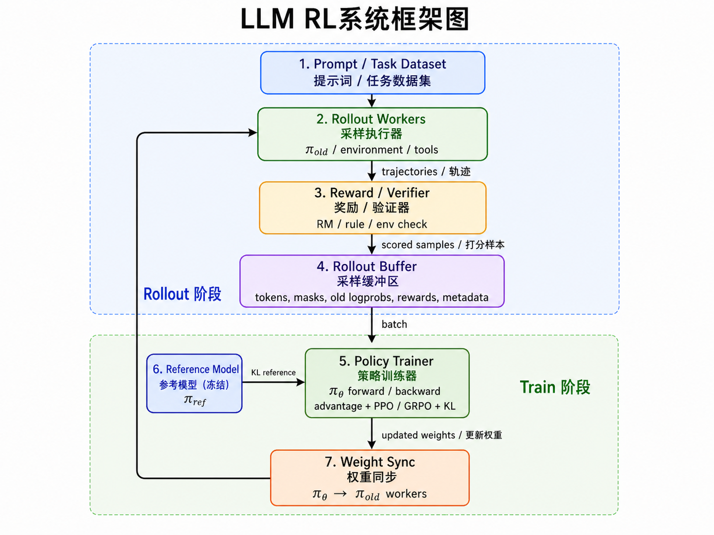

# 大模型后训练中的 RL 系统：从 SFT、RLHF、RLVR 到 Agentic RL

本文从宏观角度介绍大模型后训练中的强化学习系统。重点回答三个问题：

1. 为什么大模型后训练会从 SFT 走向 RL？
2. RLHF、RLVR、Agentic RL 的边界分别是什么？
3. 一个抽象的 LLM RL 系统应该由哪些模块组成，同步和异步系统有什么区别？

本文中的 LLM RL 主要指 post-training 阶段的 policy optimization：给定一个已经预训练或 SFT 过的语言模型，通过采样、奖励和策略梯度继续优化模型行为。

## 1. 大模型后训练：从 SFT 到 RL

### 1.1 后训练的位置

大模型训练通常可以粗略分成三层：

- Pretraining：学语言、知识、代码、世界模式、基础推理能力

- Supervised Fine-Tuning, SFT：学指令格式、回答风格、任务模板、工具调用协议

- Reinforcement Learning, RL：按奖励优化行为分布，让模型在可评价目标上主动探索更优策略


预训练解决“模型会不会说话、懂不懂世界”；SFT 解决“模型是否会按人类期望的格式回答”；RL 进一步解决“在多个可能回答或行动中，模型是否更倾向于产生高奖励行为”。

三者不是互斥关系。实践中常见流程是：

```text
base model
  -> instruction SFT
  -> preference training / RLHF
  -> verifiable RL / reasoning RL
  -> agentic RL / tool-use RL
  -> distillation / rejection sampling 回流
```

### 1.2 SFT 的目标函数

SFT 本质上是条件语言建模。给定监督数据集：

$$
D_{sft} = {(x_i, y_i)}_{i=1}^N
$$

其中 $x_i$ 是 prompt / instruction，$y_i = (y_{i,1}, ..., y_{i,T_i})$ 是人工或强模型生成的理想回答。SFT 最大化参考答案在模型下的条件概率：

$$
\max_{\theta}
\mathbb{E}_{(x,y)\sim D_{\mathrm{sft}}}
\left[
\sum_{t=1}^{T}
\log \pi_{\theta}(y_t \mid x, y_{<t})
\right]
$$

等价地，最小化 token-level negative log likelihood：

$$
\mathcal{L}_{\mathrm{SFT}}(\theta)
=
-
\mathbb{E}_{(x,y)\sim D_{\mathrm{sft}}}
\left[
\sum_{t=1}^{T}
\log \pi_{\theta}(y_t \mid x, y_{<t})
\right]
$$

SFT 的优点是稳定、简单、样本效率高。只要数据质量好，模型很快学会格式和行为模板。

但 SFT 也有根本限制：

- 它只模仿数据中的答案，不直接优化“最终效果”。
- 它无法从多个候选答案中知道哪个更好，除非监督数据已经体现了这种偏好。
- 它对超出示范分布的探索能力弱。
- 对数学、代码、agent 任务来说，正确策略可能不是单条示范能覆盖的。
- 如果训练数据中混有错误推理，模型会忠实模仿错误。

简言之，SFT 是 imitation learning，而 RL 是 reward-driven optimization。

### 1.3 LLM RL 的基本问题形式

在最简单的单轮 LLM RL 中，模型面对 prompt $x$，生成 response $y$：

$$
y \sim \pi_{\theta}(\cdot \mid x)
$$

奖励函数给出分数：

$$
r = R(x,y)
$$

目标是最大化期望奖励，同时避免模型偏离原始语言能力太远：

$$
\max_{\theta}
\mathbb{E}_{x\sim D,\, y\sim \pi_{\theta}(\cdot\mid x)}
\left[
R(x,y)
\right]
-
\beta\,
\mathbb{E}_{x\sim D}
\left[
D_{\mathrm{KL}}\bigl(
\pi_{\theta}(\cdot\mid x)
\;\|\;
\pi_{\mathrm{ref}}(\cdot\mid x)
\bigr)
\right]
$$

其中：

- `policy model` $\pi_{\theta}$ 是正在训练的模型。
- `reference model` $\pi_{\mathrm{ref}}$ 通常是 SFT checkpoint 的冻结副本。
- $R(x,y)$ 可以来自 reward model、人类偏好、规则验证器、单元测试、环境反馈等。
- KL 项用于约束策略不要过度漂移，避免语言质量、格式和安全性崩坏。

把语言模型看作策略时，完整回答的概率是逐 token 相乘：

$$
\pi_{\theta}(y\mid x)
=
\prod_{t=1}^{T}
\pi_{\theta}(y_t \mid x,y_{<t})
$$

对应的 log probability 是：

$$
\log \pi_{\theta}(y\mid x)
=
\sum_{t=1}^{T}
\log \pi_{\theta}(y_t \mid x,y_{<t})
$$

因此 LLM RL 的 policy gradient 通常在 token 级别计算，但奖励往往是 response-level 或 trajectory-level。

### 1.4 RL 算法概览：Policy Gradient、PPO 与 GRPO

设轨迹或回答为 $\tau$，奖励为 $R(\tau)$。强化学习目标为：

$$
J(\theta)
=
\mathbb{E}_{\tau\sim \pi_{\theta}}
\left[
R(\tau)
\right]
$$

Policy Gradient 的基本思想是：如果某条轨迹获得了高奖励，就提高这条轨迹中动作的概率；如果奖励低，就降低其概率。REINFORCE 给出的基础梯度是：

$$
\nabla_{\theta}J(\theta)
=
\mathbb{E}_{\tau\sim \pi_{\theta}}
\left[
R(\tau)
\nabla_{\theta}\log \pi_{\theta}(\tau)
\right]
$$


LLM RL 的难点在于：模型参数巨大，回答序列很长，奖励稀疏，不能像传统 RL 那样随意进行大步策略更新。因此 PPO、GRPO 这类稳定策略优化算法成为主流。PPO 通过概率比裁剪限制新旧策略差异，GRPO 用同一 prompt 下多个样本的组内相对奖励估计 advantage。更详细的算法介绍可以参考：

- [REINFORCE 笔记](../RL-Algorithm/2-REINFORCE.md)
- [PPO 笔记](../RL-Algorithm/5-PPO.md)
- [GRPO 系列笔记](../RL-Algorithm/7-GRPO系列.md)


## 2. RLHF、RLVR、Agentic RL

### 2.1 三者的核心区别

它们不是互斥集合，而是从不同维度描述 LLM RL：

- RLHF：用人类偏好训练 reward model，再用 RL 优化模型对齐人类偏好。强调 reward 的来源是 human feedback / human preference。
- RLVR：用可验证规则或程序给 reward，优化数学、代码、格式、证明等可自动判定任务。强调 reward 可被自动、客观、程序化验证。
- Agentic RL：把模型放进多步交互环境中，让它通过规划、工具调用、观察反馈和长期轨迹奖励学习行动策略。强调任务形态是多步交互式 decision making。

一个系统可以同时是 RLVR 和 Agentic RL。例如代码修复 agent：模型多轮查看文件、编辑代码、运行测试，最终 reward 来自单元测试是否通过。这既是 agentic，因为有多步工具交互；也是 RLVR，因为 reward 可由测试验证。

### 2.2 RLHF：Reinforcement Learning from Human Feedback

RLHF 的经典流程在 InstructGPT 中非常清楚：

```text
1. 收集人工示范，做 SFT
2. 对同一 prompt 采样多个回答，让人类排序
3. 用偏好排序训练 reward model
4. 用 PPO 优化 SFT policy，使其获得更高 reward model 分数
```

#### 2.2.1 Reward Model

给定 prompt $x$ 和两个回答 $y^+$、$y^-$，其中人类偏好 $y^+$ 胜过 $y^-$。reward model $r_{\phi}(x,y)$ 的 Bradley-Terry / pairwise ranking loss 通常写作：

$$
\mathcal{L}_{\mathrm{RM}}(\phi)
=
-
\mathbb{E}_{(x,y^+,y^-)}
\left[
\log
\sigma
\left(
r_{\phi}(x,y^+)
-
r_{\phi}(x,y^-)
\right)
\right]
$$

其中 $\sigma$ 是 sigmoid。这个 loss 鼓励：

$$
r_{\phi}(x,y^+) > r_{\phi}(x,y^-)
$$

训练好 reward model 后，RL 阶段用它近似人类偏好：

$$
R(x,y) = r_{\phi}(x,y)
$$

#### 2.2.2 RLHF 的优化目标

RLHF 的 policy objective 可写成：

$$
\max_{\theta}
\mathbb{E}_{x\sim D,\,y\sim\pi_{\theta}}
\left[
r_{\phi}(x,y)
-
\beta
\log
\frac{
\pi_{\theta}(y\mid x)
}{
\pi_{\mathrm{ref}}(y\mid x)
}
\right]
$$

其中第二项就是相对 reference model 的 KL penalty。

展开到 token 级别：

$$
\log
\frac{
\pi_{\theta}(y\mid x)
}{
\pi_{\mathrm{ref}}(y\mid x)
}
=
\sum_{t=1}^{T}
\left[
\log\pi_{\theta}(y_t\mid x,y_{<t})
-
\log\pi_{\mathrm{ref}}(y_t\mid x,y_{<t})
\right]
$$

经典 RLHF 通常用 PPO 做 policy optimization。令旧策略为 $\pi_{\theta_{\mathrm{old}}}$，当前策略为 $\pi_{\theta}$。对 token $y_t$，概率比为：

$$
\rho_t(\theta)
=
\frac{
\pi_{\theta}(y_t \mid x,y_{<t})
}{
\pi_{\theta_{\mathrm{old}}}(y_t \mid x,y_{<t})
}
$$

PPO 使用 clipped objective 限制单次更新幅度：

$$
\mathcal{L}_{\mathrm{PPO}}(\theta)
=
\mathbb{E}_{t}
\left[
\min
\left(
\rho_t(\theta) A_t,\,
\mathrm{clip}(\rho_t(\theta), 1-\epsilon, 1+\epsilon) A_t
\right)
\right]
$$

其中 $A_t$ 通常由 reward model 分数、KL penalty 和 value model / critic 估计得到。也正因为需要 reward model、reference model、policy model 和 critic，经典 PPO-RLHF 的系统复杂度较高。

RLHF 的优点：

- 能优化“有帮助、无害、诚实、符合人类偏好”等难以写成规则的目标。
- 适合开放域聊天、指令遵循、安全对齐、风格偏好。
- human preference 能覆盖很多主观质量维度。

RLHF 的局限：

- 人类标注成本高。
- reward model 可能被 policy hack。
- reward model 只是人类偏好的近似，不等于真实目标。
- PPO + RM + critic 的系统复杂度高。
- 对数学、代码这类有明确正确性的任务，主观偏好不是最直接的奖励。

经典 InstructGPT 路线是 SFT -> RM -> PPO，但 RLHF 不一定只能用 PPO，也可以和其他 preference optimization 方法结合。

### 2.3 RLVR：Reinforcement Learning with Verifiable Rewards

RLVR 指用可验证奖励进行强化学习。它的关键不是“人更喜欢哪个回答”，而是“这个回答能否被规则、程序或环境客观验证”。

典型 reward 来源包括：

- 数学题：最终答案是否等于标准答案。
- 代码题：单元测试是否通过。
- 证明题：形式化证明是否通过 verifier。
- 结构化输出：JSON schema 是否合法。
- 数据库 / text-to-SQL：SQL 执行结果是否正确。
- 工具任务：环境最终状态是否满足目标。

RLVR 的奖励可以写作：

$$
R(x,y)
=
V(x,y)
$$

其中 $V$ 是 verifier。最简单的二值奖励：

$$
V(x,y)
=
\begin{cases}
1, & \text{answer is correct and format is valid} \\
0, & \text{otherwise}
\end{cases}
$$

也可以加入格式奖励：

$$
R(x,y)
=
\lambda_{\mathrm{ans}}R_{\mathrm{answer}}(x,y)
+
\lambda_{\mathrm{fmt}}R_{\mathrm{format}}(x,y)
$$

或代码任务中的测试奖励：

$$
R(x,y)
=
\frac{
\#\text{passed tests}
}{
\#\text{total tests}
}
-
\lambda_{\mathrm{reg}}\mathbf{1}[\text{regression}]
$$

RLVR 的重要性在于：它把 reward model 从“学出来的偏好模型”换成“可执行、可复现的验证器”。Tulu 3 把 RLVR 列为其 post-training recipe 的关键组成部分；DeepSeek-R1 展示了纯 RL 能在 verifiable tasks 上激发推理模式；DeepSeekMath 引入 GRPO 并在数学推理上获得显著收益。

#### 2.3.1 RLVR 与 GRPO 的关系

RLVR 常配 GRPO，是因为二者天然契合：

```text
同一数学题 / 代码题
  -> 采样多个候选答案
  -> verifier 给出每个候选 reward
  -> 组内比较得到 advantage
  -> GRPO 更新 policy
```

公式上，给定同一 prompt 的 $G$ 个样本：

$$
y_1, y_2, \ldots, y_G
\sim
\pi_{\theta_{\mathrm{old}}}(\cdot \mid x),
\quad
R_i = V(x,y_i)
$$

组内标准化 advantage 为：

$$
A_i
=
\frac{
V(x,y_i)
-
\frac{1}{G}\sum_{j=1}^{G}V(x,y_j)
}{
\mathrm{std}(V(x,y_1),...,V(x,y_G))+\delta
}
$$

不做标准差归一化时，也可只使用中心化奖励：

$$
A_i = R_i - \frac{1}{G}\sum_{j=1}^{G}R_j
$$

对第 $i$ 个回答的第 $t$ 个 token：

$$
\rho_{i,t}(\theta)
=
\frac{
\pi_{\theta}(y_{i,t}\mid x,y_{i,<t})
}{
\pi_{\theta_{\mathrm{old}}}(y_{i,t}\mid x,y_{i,<t})
}
$$

GRPO 的 clipped objective 可写为：

$$
\mathcal{L}_{\mathrm{GRPO}}(\theta)
=
\mathbb{E}_{i,t}
\left[
\min
\left(
\rho_{i,t}(\theta) A_i,\,
\mathrm{clip}(\rho_{i,t}(\theta),1-\epsilon,1+\epsilon) A_i
\right)
\right]
-
\beta
D_{\mathrm{KL}}
\left(
\pi_{\theta}
\;\|\;
\pi_{\mathrm{ref}}
\right)
$$

如果某个回答通过 verifier，而同组其他回答没有通过，它会获得正 advantage；如果同组都错或都对，则优势信号变弱。这也是为什么 RLVR 中常需要足够高的 sampling diversity，以及动态过滤“全对 / 全错”样本。

#### 2.3.2 RLVR 的优点

- 奖励客观、可复现。
- 不需要训练 reward model。
- 可扩展到大规模自动采样。
- 对数学、代码、形式验证等任务非常有效。
- 可以促进模型通过探索发现更好的 reasoning path。

#### 2.3.3 RLVR 的局限

- 只适合目标可验证的任务。
- verifier 可能有漏洞，导致 reward hacking。
- 二值奖励稀疏，探索难。
- 最终答案正确不保证 reasoning 过程正确。
- 对开放域写作、主观帮助性、安全价值判断等任务不够充分。

RLVR 不限于 rule-based reward，也可以是可执行测试、形式验证、环境终态检查或其他自动 verifier；算法也不限于 GRPO，但 GRPO 是当前很常见的选择。

### 2.4 Agentic RL

Agentic RL 关注的是任务形态：模型不再只是一次性生成答案，而是作为 agent 在环境中多步行动。

一个 agentic 任务可以建模为 POMDP：

$$
\mathcal{M}
=
(\mathcal{S},\mathcal{A},\mathcal{O},P,O,R,\gamma)
$$

其中：

- $s_t\in\mathcal{S}$：环境真实状态，可能不可完全观察。
- $o_t\in\mathcal{O}$：agent 看到的 observation。
- $a_t\in\mathcal{A}$：agent 采取的动作，如工具调用、搜索、代码执行、浏览器点击、回复用户。
- $P(s_{t+1}\mid s_t,a_t)$：环境转移。
- $O(o_t\mid s_t)$：观察函数。
- $R(\tau)$ 或 $r_t$：轨迹奖励或步骤奖励。
- $\gamma$：折扣因子。

LLM policy 是：

$$
a_t \sim \pi_{\theta}(\cdot \mid h_t)
$$

其中历史上下文：

$$
h_t = (o_0,a_0,o_1,a_1,\ldots,o_t)
$$

完整轨迹：

$$
\tau =
(o_0,a_0,o_1,a_1,\ldots,o_T)
$$

目标：

$$
\max_{\theta}
\mathbb{E}_{\tau\sim \pi_{\theta}}
\left[
\sum_{t=0}^{T}
\gamma^t r_t
\right]
$$

或者只有最终奖励：

$$
\max_{\theta}
\mathbb{E}_{\tau\sim \pi_{\theta}}
\left[
R(\tau)
\right]
$$

Agentic RL 的典型任务：

- 搜索问答：模型决定何时搜索、搜什么、如何整合证据。
- 代码修复：查看文件、编辑代码、运行测试、根据报错继续修改。
- Web agent：点击、输入、导航、完成网页任务。
- Tool-use math：调用 Python / calculator / symbolic solver。
- Text-to-SQL agent：查询 schema、生成 SQL、执行、修正。
- Multi-agent workflow：多个模型角色协作、评审、改写、选择。

Agentic RL 的 reward 可以来自：

- RLHF：人类评价 agent 轨迹是否好。
- RLVR：环境终态、测试、规则验证。
- 混合奖励：任务成功 + 成本惩罚 + 安全约束 + 人类偏好。

因此 Agentic RL 和 RLHF / RLVR 是交叉关系：

| 类型 | 核心定义维度 | 奖励来源 | 任务形态 |
| --- | --- | --- | --- |
| RLHF | 人类反馈 | 人类偏好训练的 RM 或直接偏好 | 单轮或多轮均可 |
| RLVR | 可验证奖励 | rule / verifier / tests / environment check | 单轮或多轮均可 |
| Agentic RL | 多步交互 agent | 人类、规则、环境、模型均可 | 多步 POMDP / agent trajectory |

Agentic RL 的新增难点：

- credit assignment：最终成功或失败应归因于哪一步动作？
- 长轨迹训练：上下文长、token 多、显存和吞吐压力大。
- 工具 observation mask：环境返回不是模型动作，不能错误训练。
- 环境非平稳：网页、搜索、外部工具可能变化。
- 安全边界：agent 能调用工具，reward hacking 风险更高。
- 异步系统：长尾任务多，同步 rollout 会浪费大量资源。

## 3. RL 系统


这一节抽象一个 LLM RL 系统原型，如上图所示。无论是 RLHF、RLVR 还是 Agentic RL，系统层面通常都绕不开四个核心模块：

- policy model $\pi_{\theta}$
- reference model $\pi_{ref}$
- rollout model $\pi_{old}$
- reward (model or rule) $R$

以及两个核心阶段：
- rollout：采样轨迹
- train：训练模型


### 3.1 核心模块

这一节只从系统角度定义四个模块，具体 reward 形式和 PPO / GRPO 公式已经在第 2 节展开。

- **Policy model $\pi_{\theta}$**：正在训练的模型，接收 prompt 或 agent history，输出 token / action，并在 train 阶段反向传播更新参数。
- **Reference model $\pi_{\mathrm{ref}}$**：通常是冻结的 SFT 模型，用于 KL 约束，提供语言质量、格式和安全边界上的先验。
- **Rollout model $\pi_{\mathrm{old}}$**：负责采样训练数据的旧策略。PPO / GRPO 都需要知道样本来自哪个策略，因此训练时会用 $\pi_{\theta}$ 与 $\pi_{\mathrm{old}}$ 的 logprob 计算 ratio。
- **Reward $R$**：RL 系统的目标接口。RLHF 中通常来自 reward model，RLVR 中来自 verifier / rule / unit tests，Agentic RL 中可以来自轨迹成功率、过程约束、成本和安全信号的组合。

在实现上，$\pi_{\mathrm{old}}$ 不一定是一份完整模型，常见形式有三种：

1. rollout engine 当前加载的 actor 权重。
2. 训练侧保存的 old actor checkpoint。
3. rollout 时记录下来的 token logprob：

$$
\log\pi_{\mathrm{old}}(y_t\mid x,y_{<t})
$$

第三种在异步系统中尤其重要：只要 rollout 时保存 old logprob，训练侧就可以计算 PPO / GRPO ratio，而不一定需要保留完整 old model。Reward 也可以是单轮 $R(x,y)$、轨迹级 $R(\tau)$，或步骤级 return $G_t=\sum_{l=t}^{T}\gamma^{l-t}r_l$。

### 3.2 Rollout 阶段

rollout 阶段负责生成训练数据。

#### 3.2.1 单轮 rollout

对每个 prompt：

```text
x ~ D
y_i ~ π_old(. | x), i = 1,...,G
R_i = R(x, y_i)
logp_old_i,t = log π_old(y_i,t | x, y_i,<t)
```

输出训练样本：

```text
{
  prompt,
  response,
  tokens,
  response_mask,
  old_log_probs,
  rewards,
  metadata
}
```

其中 `response_mask` 或 `loss_mask` 表示哪些 token 是 policy action，需要参与 loss。

#### 3.2.2 Agentic rollout

agentic rollout 是一个环境交互循环：

```text
h_0 = init(prompt, environment)

for t = 0 ... T:
    a_t ~ π_old(. | h_t)
    o_{t+1} = env.step(a_t)
    h_{t+1} = concat(h_t, a_t, o_{t+1})
    if done:
        break

R = reward(trajectory)
```

最终仍要转换成训练系统能理解的数据：

```text
trajectory tokens
action masks
observation masks
old logprobs
trajectory reward
metadata
```

在 LLM agent 中，模型生成的 action token 应该 mask 为 1；工具返回、搜索结果、单元测试输出、网页 observation 等环境 token 应该 mask 为 0。

### 3.3 Train 阶段

train 阶段负责把 rollout 数据转化为 policy gradient。

一个典型训练步骤：

```text
1. 读取 rollout batch
2. 当前 policy 前向，计算 log π_θ
3. reference model 前向，计算 log π_ref
4. 计算 reward / advantage / return
5. 计算 PPO 或 GRPO objective
6. 反向传播，更新 policy model
7. 按需同步 rollout model 权重
```

因此 train 阶段本质上是在做三件事：用 rollout 数据估计 advantage，用当前 policy 和 old policy 的 logprob 构造 policy loss，再用 reference model 的 KL 约束更新幅度。具体到 PPO / GRPO 的 clipped objective，分别见 2.2 和 2.3。工程上常见的总 loss 可以概括为：

$$
\mathcal{L}
=
\mathcal{L}_{\mathrm{policy}}
+
\beta \mathcal{L}_{\mathrm{KL}}
-
\alpha \mathcal{H}(\pi_{\theta})
$$

其中 $\mathcal{H}$ 是 entropy bonus，可选。

### 3.4 同步 RL 系统

同步系统的时间线：

```text
rollout_0
  -> train_0
  -> update rollout weights
  -> rollout_1
  -> train_1
  -> update rollout weights
  -> ...
```

伪代码：

```python
for step in range(num_steps):
    rollout_model.load(policy_model.weights)

    batch = rollout(
        model=rollout_model,
        prompts=sample_prompts(),
    )

    train(
        policy_model=policy_model,
        reference_model=reference_model,
        batch=batch,
    )
```

同步系统的优点：

- 数据最接近 on-policy。
- 实现简单，调试容易。
- 权重版本清晰。
- reward、advantage、ratio 的语义最干净。

同步系统的缺点：

- rollout 时训练 GPU 可能空闲。
- train 时 rollout GPU 可能空闲。
- agentic rollout 有长尾，最慢任务会拖住整批。
- 多工具、多环境任务下吞吐差。

同步系统适合：

- 小规模实验。
- 算法验证。
- 严格 on-policy 的训练。
- rollout 成本和 train 成本都不太高的任务。

### 3.5 异步 RL 系统

异步系统试图让 rollout 和 train 重叠。

最简单的一步异步：

```text
rollout_0
  -> train_0       + rollout_1
  -> train_1       + rollout_2
  -> train_2       + rollout_3
```

更彻底的 producer-consumer 异步：

```text
rollout workers:
  不断从任务池取 prompt，生成 trajectories，写入 replay / rollout buffer

trainer:
  不断从 buffer 取 batch，计算 loss，更新 policy

weight sync:
  周期性把 policy 权重推送给 rollout workers
```

伪代码：

```python
# rollout worker
while True:
    weights = maybe_refresh_weights()
    task = task_queue.get()
    trajectory = run_agent(policy=rollout_model, task=task)
    reward = compute_reward(trajectory)
    buffer.put(trajectory, reward, old_log_probs, weight_version)

# trainer
while True:
    batch = buffer.get()
    loss = compute_rl_loss(policy_model, reference_model, batch)
    optimizer.step(loss)
    maybe_publish_weights(policy_model)
```

异步系统的优点：

- 训练和推理资源利用率高。
- 能缓解 agentic rollout 长尾。
- 易扩展到大量环境 worker。
- 更适合真实工具调用、网页、代码执行等慢环境。

异步系统的核心问题是 policy staleness。

如果 rollout worker 用的是旧权重 $\pi_{\theta_{k-m}}$，trainer 当前模型已经是 $\pi_{\theta_k}$，则样本不是严格 on-policy：

$$
y \sim \pi_{\theta_{k-m}}(\cdot\mid x)
\quad
\text{but train with}
\quad
\pi_{\theta_k}
$$

这会影响 PPO / GRPO 的 ratio 和 advantage 解释。

缓解方法包括：

1. 记录 rollout logprob：

$$
\log\pi_{\mathrm{rollout}}(y_t\mid x,y_{<t})
$$

2. 记录 weight version，限制最大 staleness。

3. 使用 importance sampling：

$$
w_t
=
\frac{
\pi_{\theta}(y_t\mid x,y_{<t})
}{
\pi_{\mathrm{rollout}}(y_t\mid x,y_{<t})
}
$$

4. 使用 clipped ratio 或 TIS：

$$
\tilde{w}_t = \mathrm{clip}(w_t, w_{\min}, w_{\max})
$$

5. 更新 rollout 权重前等待正在生成的 trajectory 完成，避免单条轨迹内部混合多个 policy。

异步系统适合：

- agentic RL。
- 长轨迹工具调用。
- rollout 显著慢于 train 或延迟方差很大。
- 大规模分布式训练。

不适合：

- 对 on-policy 极其敏感的算法实验。
- 没有 rollout logprob / weight version 的粗糙实现。
- reward 很脆弱且容易被旧策略分布污染的任务。


### 3.6 系统实现中的关键不变量

一个可靠的 LLM RL 系统必须保证以下不变量：

1. `tokens` 与 `old_log_probs` 对齐。
2. `loss_mask` 与 response token 长度一致。
3. prompt token 不参与 policy loss。
4. environment observation token 不参与 policy loss。
5. reward 与 sample / trajectory 一一对应。
6. GRPO group 不能被错误打散，否则组内 advantage 错位。
7. rollout 权重版本可追踪。
8. KL reference 固定或按明确策略更新。
9. 异步 buffer 中样本 staleness 有上限。
10. reward verifier 和训练环境要隔离，避免 reward hacking。

## 4. 小结

大模型后训练中的 RL 可以从两个维度理解：SFT 是模仿标准答案、优化 log likelihood；RL 是采样候选行为、根据 reward 改变模型分布。RLHF、RLVR、Agentic RL 则分别强调不同的 reward 来源和任务形态：RLHF 面向人类偏好，经典路线是 SFT -> RM -> PPO；RLVR 面向可验证任务，常用 verifier + GRPO；Agentic RL 面向多步交互，reward 可以来自人类、规则、环境或混合信号。

从系统角度看，LLM RL 的核心闭环始终是：

```text
π_old rollout
  -> reward / verifier 打分
  -> advantage estimation
  -> π_θ train
  -> KL to π_ref
  -> weight sync
  -> next rollout
```

同步系统更接近 on-policy，逻辑清晰；异步系统吞吐更高，更适合长轨迹、慢工具和长尾明显的 Agentic RL，但必须处理 policy staleness，保存 rollout logprob / weight version，并用 clipping、importance correction 或 staleness control 保持训练稳定。最终，RLHF、RLVR、Agentic RL 不是互相替代的阶段，而是大模型后训练 RL 生态中的三种核心范式：主观偏好对齐、可验证能力提升、多步决策能力训练。

## 参考资料

- [Training language models to follow instructions with human feedback, Ouyang et al., 2022](https://arxiv.org/abs/2203.02155)：InstructGPT / RLHF 经典路线，SFT -> reward model -> PPO。
- [Proximal Policy Optimization Algorithms, Schulman et al., 2017](https://arxiv.org/abs/1707.06347)：PPO 原始论文，提出 clipped surrogate objective。
- [DeepSeekMath: Pushing the Limits of Mathematical Reasoning in Open Language Models, Shao et al., 2024](https://arxiv.org/abs/2402.03300)：提出 GRPO，并用于数学推理强化学习。
- [Tulu 3: Pushing Frontiers in Open Language Model Post-Training, Lambert et al., 2024/2025](https://arxiv.org/abs/2411.15124)：开放后训练 recipe，包含 SFT、DPO、RLVR。
- [DeepSeek-R1: Incentivizing Reasoning Capability in LLMs via Reinforcement Learning, DeepSeek-AI, 2025/2026](https://arxiv.org/abs/2501.12948)：展示通过 RL 激发推理能力，强调数学、代码、STEM 等可验证任务。
- [Reinforcement Learning with Verifiable Rewards Implicitly Incentivizes Correct Reasoning in Base LLMs, Wen et al., 2025](https://arxiv.org/abs/2506.14245)：分析 RLVR 对 LLM reasoning 的影响。
- [Agent Lightning: Train ANY AI Agents with Reinforcement Learning, Luo et al., 2025](https://arxiv.org/abs/2508.03680)：将 agent 执行建模为 MDP，强调 agent execution 与 RL training 解耦。
- [The Landscape of Agentic Reinforcement Learning for LLMs: A Survey, Zhang et al., 2025/2026](https://arxiv.org/abs/2509.02547)：系统区分传统 LLM RL 与 Agentic RL，强调 POMDP、多步决策、工具、记忆和规划。