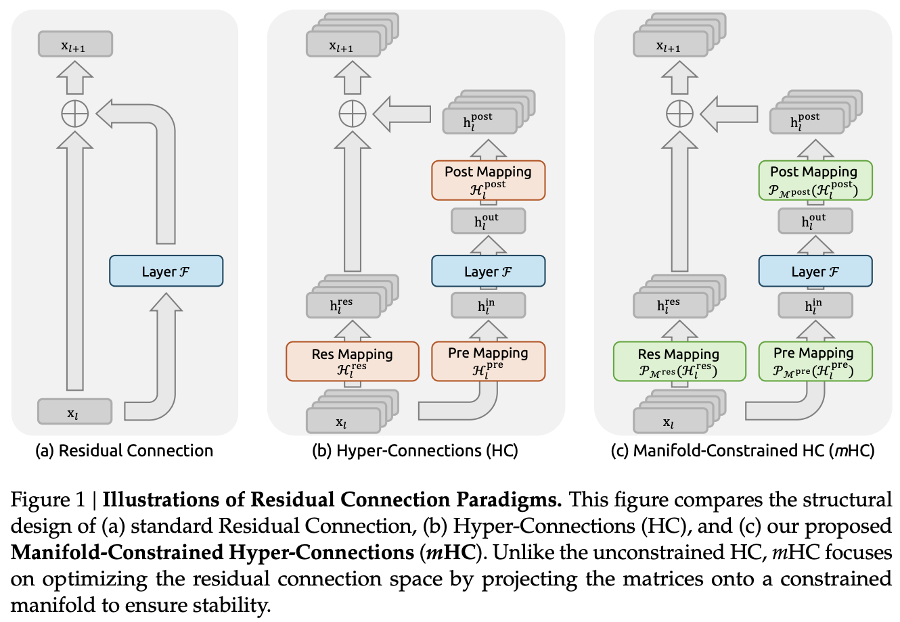

# 从残差连接到 Hyper-Connections，再到 DeepSeek 的 mHC

这篇笔记想回答一个问题：如果残差连接已经足够稳定，为什么还要提出 HC；如果 HC 能增强表达，为什么 DeepSeek 又要给它加上 mHC 这样的流形约束？

一句话概括：残差连接把信息稳定地沿深度传下去；HC 把一条残差流扩展成多条可学习的信息高速路；mHC 则把这些可学习连接限制在“双随机矩阵”这个稳定集合里，让多路连接既能混合，又不至于放大或吞掉信号。

> mHC大白话解释：将原本d维特征变成n个d维特征，输入层函数（Attention/MLP）前进行加权求和变为d，层输出后又乘上系数变为nxd。残差连接是nxd的特征乘上nxn的矩阵，对特征进行一次变换。mHC对这个nxn的矩阵约束为行和/列和为1，保证均值稳定性。



## 0. 符号约定

为了把三种方法放在同一张图里，我们先约定一些记号。

- $l$ 表示层号，$L$ 表示更深的一层。
- $C$ 是普通 hidden state 的通道维度。
- $n$ 是 HC/mHC 的 residual stream expansion rate，也就是把一条残差流扩成 $n$ 条。
- $\mathcal{F}_l(\cdot)$ 表示第 $l$ 层的实际计算模块，比如 Transformer 里的 Attention 或 FFN。
- 普通残差里隐藏状态写作 $\mathbf{x}_l \in \mathbb{R}^{C}$。
- HC/mHC 里隐藏状态写作 $\mathbf{X}_l \in \mathbb{R}^{n \times C}$，可以理解为 $n$ 条 residual stream，每条宽度仍然是 $C$。

下面所有矩阵乘法默认作用在 stream 维度上，通道维度 $C$ 不被这些连接矩阵改变。

## 1. 传统残差连接：为什么它这么稳？

最经典的残差层可以写成：

$$
\mathbf{x}_{l+1}
= \mathbf{x}_l + \mathcal{F}_l(\mathbf{x}_l).
$$

这里的 $+ \mathbf{x}_l$ 就是残差连接。它的核心作用不是“多加了一个东西”这么简单，而是给深层网络提供了一条恒等映射路径。把上式从第 $l$ 层递推到第 $L$ 层：

$$
\begin{aligned}
\mathbf{x}_{l+1}
&= \mathbf{x}_l + \mathcal{F}_l(\mathbf{x}_l), \\
\mathbf{x}_{l+2}
&= \mathbf{x}_{l+1} + \mathcal{F}_{l+1}(\mathbf{x}_{l+1}) \\
&= \mathbf{x}_l
 + \mathcal{F}_l(\mathbf{x}_l)
 + \mathcal{F}_{l+1}(\mathbf{x}_{l+1}), \\
&\cdots \\
\mathbf{x}_{L}
&= \mathbf{x}_l
 + \sum_{i=l}^{L-1}\mathcal{F}_i(\mathbf{x}_i).
\end{aligned}
$$

注意第一项仍然是未经修改的 $\mathbf{x}_l$。这就是 identity mapping：浅层信号可以不经过任何复杂变换，直接到达深层。

### 1.1 前向稳定性

如果没有残差，网络一般是：

$$
\mathbf{x}_{l+1}=\mathcal{F}_l(\mathbf{x}_l).
$$

多层叠起来后，浅层信号要经过一串非线性函数。只要其中某些层尺度偏小，信号就可能逐渐消失；尺度偏大，则可能爆炸。

残差连接把传播改成：

$$
\mathbf{x}_{l+1}=\mathbf{x}_l+\Delta_l,
\quad \Delta_l=\mathcal{F}_l(\mathbf{x}_l).
$$

也就是说，每层默认先“保留原信号”，再学习一个增量。深层模型不需要每层都重新生成表示，只需要逐步修正表示。这也是 ResNet、Pre-Norm Transformer 能训练得很深的重要原因。

### 1.2 反向稳定性

设损失函数为 $\mathcal{L}$。由

$$
\mathbf{x}_{L}
= \mathbf{x}_l + \sum_{i=l}^{L-1}\mathcal{F}_i(\mathbf{x}_i)
$$

可得：

$$
\frac{\partial \mathcal{L}}{\partial \mathbf{x}_l}
=
\frac{\partial \mathcal{L}}{\partial \mathbf{x}_L}
\left(
1+
\frac{\partial}{\partial \mathbf{x}_l}
\sum_{i=l}^{L-1}\mathcal{F}_i(\mathbf{x}_i)
\right).
$$

更直观地说，梯度里至少存在一条不经过连续矩阵乘积的直通路径。传统深层网络的问题常常来自链式法则中的大量 Jacobian 相乘：

$$
\prod_i \frac{\partial \mathcal{F}_i}{\partial \mathbf{x}_i}.
$$

残差连接不能保证所有梯度都稳定，但它保证了有一条 identity gradient path。这就是它训练大模型时特别可靠的原因。

### 1.3 传统残差的局限

残差连接很稳，但也很“单线条”：第 $l$ 层只有一条 residual stream，所有历史信息都被压在同一个 $C$ 维向量里。Transformer 的 Attention/FFN 在微观模块上越来越强，但宏观拓扑仍然基本是：

```text
x_0 -> block_0 -> x_1 -> block_1 -> x_2 -> ... -> x_L
```

这会带来一个自然问题：能不能保留残差的稳定性，同时让不同深度、不同路径的表示以更丰富的方式流动？

这就是 Hyper-Connections 想做的事。

## 2. Hyper-Connections：把一条残差流扩成多条流

Hyper-Connections，简称 HC，是字节跳动相关研究提出的一种宏观拓扑扩展。它可以看成传统残差连接的多流版本：不直接把 Attention 或 FFN 的计算宽度扩大，而是把 residual stream 从一条扩展成 $n$ 条：

$$
\mathbf{X}_l
=
\begin{bmatrix}
\mathbf{x}_{l,0} \\
\mathbf{x}_{l,1} \\
\cdots \\
\mathbf{x}_{l,n-1}
\end{bmatrix}
\in \mathbb{R}^{n\times C}.
$$

每一层仍然只把一个 $C$ 维向量送进计算模块 $\mathcal{F}_l$，但这个 $C$ 维向量是从 $n$ 条 stream 中读出来的。计算完成后，输出再写回到 $n$ 条 stream 中。

HC 主要引入三组映射：

$$
\mathcal{H}^{\mathrm{pre}}_l \in \mathbb{R}^{1\times n},
\quad
\mathcal{H}^{\mathrm{post}}_l \in \mathbb{R}^{1\times n},
\quad
\mathcal{H}^{\mathrm{res}}_l \in \mathbb{R}^{n\times n}.
$$

它们的职责分别是：

| 映射 | 形状 | 作用 |
| --- | --- | --- |
| $\mathcal{H}^{pre}_l$ | $1 x n$ | 从 $n$ 条 stream 中读出一个 $C$ 维输入 |
| $\mathcal{H}^{post}_l$ | $1 x n$ | 把当前层输出写回到 $n$ 条 stream |
| $\mathcal{H}^{res}_l$ | $n x n$ | 在不经过当前计算块的情况下，让 $n$ 条 stream 之间继续传播和混合 |

单层 HC 可以写成：

$$
\mathbf{X}_{l+1}
=
\mathcal{H}^{\mathrm{res}}_l \mathbf{X}_l
+
\mathcal{H}^{\mathrm{post}\top}_l
\mathcal{F}_l(
\mathcal{H}^{\mathrm{pre}}_l \mathbf{X}_l
).
$$

这就是 HC 的核心公式。

### 2.1 公式拆开看

第一步，从多条 stream 里读：

$$
\mathbf{u}_l
=
\mathcal{H}^{\mathrm{pre}}_l\mathbf{X}_l
=
\sum_{i=0}^{n-1}
h^{\mathrm{pre}}_{l,i}\mathbf{x}_{l,i}
\in \mathbb{R}^{C}.
$$

第二步，让普通层计算：

$$
\mathbf{y}_l=\mathcal{F}_l(\mathbf{u}_l).
$$

第三步，把旧 stream 继续传下去，同时把新结果写回：

$$
\mathbf{X}_{l+1}
=
\underbrace{\mathcal{H}^{\mathrm{res}}_l \mathbf{X}_l}_{\text{旧信息在多条 stream 中传播}}
+
\underbrace{\mathcal{H}^{\mathrm{post}\top}_l\mathbf{y}_l}_{\text{当前层输出写回多条 stream}}.
$$

如果把第 $j$ 条输出 stream 单独写出来：

$$
\mathbf{x}_{l+1,j}
=
\sum_{i=0}^{n-1} h^{\mathrm{res}}_{l,j,i}\mathbf{x}_{l,i}
+
h^{\mathrm{post}}_{l,j}\mathbf{y}_l.
$$

这说明 HC 里每条 stream 都可以从多条旧 stream 接收信息，同时也可以以不同强度接收当前层的计算结果。

### 2.2 传统残差是 HC 的特例

当 $n=1$，并令：

$$
\mathcal{H}^{\mathrm{pre}}_l = [1],
\quad
\mathcal{H}^{\mathrm{post}}_l = [1],
\quad
\mathcal{H}^{\mathrm{res}}_l = [1],
$$

则 HC 公式退化成：

$$
\mathbf{X}_{l+1}
=
\mathbf{X}_l + \mathcal{F}_l(\mathbf{X}_l).
$$

这就是普通残差连接。所以可以把传统残差看成一种 $n=1$、非可学习连接矩阵固定为 $1$ 的特殊 HC。

### 2.3 HC 为什么可能更强？

普通残差只有一条信息路径：

```text
stream_0 -> stream_0 -> stream_0 -> ...
```

HC 有 $n$ 条 stream，并且每一层都可以学习如何读、如何写、如何混合：

```text
stream_0 ----\
stream_1 -----+--> read -> F_l -> write --> stream_0
stream_2 ----/                         \--> stream_1
                                           \-> stream_2
```

这种结构带来三个好处。

第一，HC 增强了跨深度的信息复用。不同 stream 可以保存不同层次的表示，有的更接近浅层，有的更接近深层，有的混合多个历史状态。

第二，HC 增强了拓扑表达力。传统 Transformer 是固定的串行堆叠，HC 则可以通过连接矩阵学习出更复杂的层间交互模式。

第三，HC 不必显著增加每个计算块的 FLOPs。因为 $\mathcal{F}_l$ 的输入仍然是 $C$ 维，而不是 $nC$ 维。真正增加的是 residual stream 的存储和连接操作。

用伪代码表示，HC 的一层大概是：

```python
def hc_layer(X, F, H_pre, H_post, H_res):
    # X: [batch, seq, n, C]
    # H_pre:  [batch, seq, n]
    # H_post: [batch, seq, n]
    # H_res:  [batch, seq, n, n]

    # 1. 从 n 条 residual streams 中读出一个 C 维输入
    u = sum_i(H_pre[..., i] * X[..., i, :])

    # 2. 普通 Transformer 子层，例如 Attention 或 FFN
    y = F(u)

    # 3. 旧 stream 经过 H_res 继续传播，新输出经过 H_post 写回
    X_res = matmul_stream(H_res, X)
    X_write = H_post[..., :, None] * y[..., None, :]

    return X_res + X_write
```

### 2.4 HC 的问题：可学习连接太自由

HC 的风险也来自它的自由度。普通残差的跨层恒等项是：

$$
\mathbf{x}_L
=
\mathbf{x}_l + \sum_{i=l}^{L-1}\mathcal{F}_i(\mathbf{x}_i).
$$

浅层信号前面的系数就是 $1$。但 HC 多层展开后：

$$
\mathbf{X}_{L}
=
\left(
\prod_{i=1}^{L-l}
\mathcal{H}^{\mathrm{res}}_{L-i}
\right)\mathbf{X}_l
+
\sum_{i=l}^{L-1}
\left(
\prod_{j=1}^{L-1-i}
\mathcal{H}^{\mathrm{res}}_{L-j}
\right)
\mathcal{H}^{\mathrm{post}\top}_i
\mathcal{F}_i(
\mathcal{H}^{\mathrm{pre}}_i\mathbf{X}_i
).
$$

关键变化是：浅层信号前面不再是固定的 $I$，而是很多个可学习矩阵的乘积：

$$
\prod_{i=1}^{L-l}\mathcal{H}^{\mathrm{res}}_{L-i}.
$$

如果这些矩阵没有约束，问题就来了。

假设某个方向上的增益是 $1.1$，堆叠 $100$ 层后大约是：

$$
1.1^{100}\approx 13780.
$$

如果某个方向上的增益是 $0.9$，堆叠 $100$ 层后大约是：

$$
0.9^{100}\approx 2.7\times 10^{-5}.
$$

这就是 HC 的核心不稳定来源：它增强了 residual topology，但削弱了 residual connection 最宝贵的 identity mapping property。浅层信号不再有一条尺度确定的直通路径，而是被一串可学习矩阵反复缩放、旋转、混合。

更细一点看，对于 $\mathbf{Z}=\mathcal{H}^{res}\mathbf{X}$，第 $j$ 条输出 stream 是：

$$
\mathbf{z}_j
=
\sum_i h_{j,i}\mathbf{x}_i.
$$

如果第 $j$ 行的和很大，则这条输出 stream 的前向信号容易被放大；如果列和很大，则反向传播时对应输入 stream 会收到过大的梯度。HC 原始形式并不保证这些行和、列和接近 $1$。

这就是 DeepSeek 提出 mHC 的动机：保留 HC 的多流表达力，但把 $\mathcal{H}^{res}$ 限制到一个稳定的几何集合里。

## 3. mHC：把残差连接矩阵投影到双随机流形

mHC 的全称是 Manifold-Constrained Hyper-Connections。它不是推翻 HC，而是在 HC 的 residual mapping 上加了一个关键约束：

$$
\mathcal{H}^{\mathrm{res}}_l
\in
\mathcal{M}^{\mathrm{res}},
$$

其中 $\mathcal{M}^{res}$ 是双随机矩阵集合，也叫 Birkhoff polytope：

$$
\mathcal{M}^{\mathrm{res}}
=
\left\{
\mathbf{H}\in\mathbb{R}^{n\times n}
\mid
\mathbf{H}\mathbf{1}_n=\mathbf{1}_n,\;
\mathbf{1}_n^\top\mathbf{H}=\mathbf{1}_n^\top,\;
\mathbf{H}\ge 0
\right\}.
$$

也就是说，mHC 要求 $\mathcal{H}^{res}$ 同时满足：

1. 所有元素非负。
2. 每一行求和为 $1$。
3. 每一列求和为 $1$。

这三个条件看起来简单，但非常有用。

### 3.1 为什么双随机矩阵能恢复稳定性？

先看前向传播。设：

$$
\mathbf{Z}
=
\mathbf{H}\mathbf{X}.
$$

第 $j$ 条输出 stream 为：

$$
\mathbf{z}_j
=
\sum_i h_{j,i}\mathbf{x}_i.
$$

如果 $\mathbf{H}$ 非负，并且第 $j$ 行和为 $1$，那么 $\mathbf{z}_j$ 是输入 streams 的凸组合：

$$
h_{j,i}\ge 0,
\quad
\sum_i h_{j,i}=1.
$$

凸组合有一个非常重要的性质：它不会凭空制造极端尺度。如果所有输入 stream 的范数都被控制住，输出 stream 也会落在这些输入的凸包里。

再看整体均值。定义 stream 维度上的平均：

$$
\bar{\mathbf{x}}
=
\frac{1}{n}\mathbf{1}_n^\top \mathbf{X}.
$$

经过 $\mathbf{H}$ 后：

$$
\bar{\mathbf{z}}
=
\frac{1}{n}\mathbf{1}_n^\top \mathbf{Z}
=
\frac{1}{n}\mathbf{1}_n^\top \mathbf{H}\mathbf{X}.
$$

如果列和为 $1$，即：

$$
\mathbf{1}_n^\top\mathbf{H}=\mathbf{1}_n^\top,
$$

则：

$$
\bar{\mathbf{z}}
=
\frac{1}{n}\mathbf{1}_n^\top\mathbf{X}
=
\bar{\mathbf{x}}.
$$

也就是说，mHC 的 residual propagation 保留了多条 stream 的全局均值。这就是它恢复 identity mapping 精神的地方：不是要求每条 stream 原封不动，而是要求整体信号量不被无约束地放大或衰减。

### 3.2 反向传播也被约束

设上游梯度为 $\mathbf{G}_{l+1}$，其中：

$$
\mathbf{X}_{l+1}
=
\mathbf{H}\mathbf{X}_l.
$$

则：

$$
\mathbf{G}_{l}
=
\mathbf{H}^{\top}\mathbf{G}_{l+1}.
$$

如果 $\mathbf{H}$ 是双随机矩阵，那么 $\mathbf{H}^{\top}$ 也是双随机矩阵。因此反向梯度在 stream 维度上也仍然是凸组合。这意味着 mHC 同时约束了前向信号和反向梯度的传播尺度。

严格说，在 HC/mHC 中这些连接系数可以依赖输入，因此完整梯度还包含“系数随输入变化”带来的额外项。这里分析的是 residual propagation 的主线性路径，也就是论文讨论 forward/backward gain 时关注的那条路径；mHC 的双随机约束首先稳定的是这条跨层传播主干。

这点非常关键：只约束行和通常更像是在控制前向输出，只约束列和更像是在控制反向分配；双随机则同时照顾两边。

### 3.3 多层复合仍然稳定

双随机矩阵还有一个闭包性质：两个双随机矩阵相乘仍然是双随机矩阵。

设 $\mathbf{A}$ 和 $\mathbf{B}$ 都是双随机矩阵，则：

$$
(\mathbf{A}\mathbf{B})\mathbf{1}
=
\mathbf{A}(\mathbf{B}\mathbf{1})
=
\mathbf{A}\mathbf{1}
=
\mathbf{1},
$$

并且：

$$
\mathbf{1}^{\top}(\mathbf{A}\mathbf{B})
=
(\mathbf{1}^{\top}\mathbf{A})\mathbf{B}
=
\mathbf{1}^{\top}\mathbf{B}
=
\mathbf{1}^{\top}.
$$

非负性也显然保留。因此：

$$
\prod_{i=1}^{L-l}
\mathcal{H}^{\mathrm{res}}_{L-i}
$$

仍然是双随机矩阵。

这正好修复了 HC 多层展开中的危险项：原来这串矩阵乘积可能带来无界放大或衰减；mHC 中它始终保持在双随机集合里，传播仍然是受控的凸组合。

### 3.4 从几何角度看：Birkhoff polytope

Birkhoff-von Neumann 定理说明：所有 $n x n$ 双随机矩阵构成的集合，正是所有置换矩阵的凸包。也就是说，任意双随机矩阵都可以写成：

$$
\mathbf{H}
=
\sum_k \lambda_k \mathbf{P}_k,
\quad
\lambda_k\ge 0,
\quad
\sum_k\lambda_k=1,
$$

其中 $\mathbf{P}_k$ 是置换矩阵。

这给 mHC 一个很漂亮的解释：$\mathcal{H}^{res}$ 不是任意混合 stream，而是在“若干种 stream 置换方案”之间做软组合。它既允许信息在 stream 之间交换，又不会破坏整体守恒。

当 $n=1$ 时，双随机矩阵集合只有一个元素 $[1]$。所以 mHC 在 $n=1$ 时自然退化为普通残差的 identity mapping。

## 4. mHC 的参数化：先生成自由矩阵，再投影

mHC 的实际实现不能直接把参数定义成双随机矩阵，否则优化会比较麻烦。更自然的做法是：

1. 先像 HC 一样生成 unconstrained raw coefficients。
2. 再把 $\tilde{\mathcal{H}}^{res}$ 投影到双随机集合。
3. 对 $pre/post$ 做非负化，避免正负抵消。

论文中的计算可以概括为：

$$
\vec{\mathbf{X}}_l=\mathrm{vec}(\mathbf{X}_l)\in\mathbb{R}^{1\times nC}.
$$

先做归一化：

$$
\vec{\mathbf{X}}'_l
=
\mathrm{RMSNorm}(\vec{\mathbf{X}}_l).
$$

然后用线性层生成三组 raw mappings：

$$
\begin{cases}
\tilde{\mathcal{H}}^{\mathrm{pre}}_l
=
\alpha_l^{\mathrm{pre}}
(\vec{\mathbf{X}}'_l\varphi_l^{\mathrm{pre}})
+\mathbf{b}_l^{\mathrm{pre}},
\\
\tilde{\mathcal{H}}^{\mathrm{post}}_l
=
\alpha_l^{\mathrm{post}}
(\vec{\mathbf{X}}'_l\varphi_l^{\mathrm{post}})
+\mathbf{b}_l^{\mathrm{post}},
\\
\tilde{\mathcal{H}}^{\mathrm{res}}_l
=
\alpha_l^{\mathrm{res}}
\mathrm{mat}(\vec{\mathbf{X}}'_l\varphi_l^{\mathrm{res}})
+\mathbf{b}_l^{\mathrm{res}}.
\end{cases}
$$

这里：

$$
\varphi_l^{\mathrm{pre}},\varphi_l^{\mathrm{post}}
\in
\mathbb{R}^{nC\times n},
\quad
\varphi_l^{\mathrm{res}}
\in
\mathbb{R}^{nC\times n^2}.
$$

得到 raw mappings 后，mHC 做如下投影：

$$
\mathcal{H}^{\mathrm{pre}}_l
=
\sigma(\tilde{\mathcal{H}}^{\mathrm{pre}}_l),
$$

$$
\mathcal{H}^{\mathrm{post}}_l
=
2\sigma(\tilde{\mathcal{H}}^{\mathrm{post}}_l),
$$

$$
\mathcal{H}^{\mathrm{res}}_l
=
\mathrm{SinkhornKnopp}(
\tilde{\mathcal{H}}^{\mathrm{res}}_l
).
$$

$pre$ 和 $post$ 用 sigmoid 是为了得到非负系数。$post$ 前面的 $2$ 可以理解为一个尺度补偿，使初始写回强度更接近 HC/残差连接需要的范围。最核心的仍然是最后一步：用 Sinkhorn-Knopp 把 residual mapping 投影成近似双随机矩阵。

## 5. Sinkhorn-Knopp：怎么把矩阵变成双随机？

Sinkhorn-Knopp 算法非常直观：对一个非负矩阵反复做行归一化和列归一化。

给定 raw matrix $\mathbf{Z}$，先把它变成正矩阵：

$$
\mathbf{P}^{(0)}=\exp(\mathbf{Z})
$$

或者用其他能保证正值的函数。然后迭代：

$$
\mathbf{P}^{(t+\frac{1}{2})}_{i,j}
=
\frac{\mathbf{P}^{(t)}_{i,j}}
{\sum_{k}\mathbf{P}^{(t)}_{i,k}},
$$

$$
\mathbf{P}^{(t+1)}_{i,j}
=
\frac{\mathbf{P}^{(t+\frac{1}{2})}_{i,j}}
{\sum_{k}\mathbf{P}^{(t+\frac{1}{2})}_{k,j}}.
$$

第一步让每一行和为 $1$，第二步让每一列和为 $1$。重复足够多次后，矩阵会接近双随机矩阵。

伪代码：

```python
def sinkhorn_knopp(Z, num_iters=20, eps=1e-6):
    # Z: [..., n, n], raw residual mapping
    P = exp(Z) + eps

    for _ in range(num_iters):
        # row normalization: sum_j P[i, j] = 1
        P = P / (P.sum(dim=-1, keepdim=True) + eps)

        # column normalization: sum_i P[i, j] = 1
        P = P / (P.sum(dim=-2, keepdim=True) + eps)

    return P
```

论文实验中使用有限次迭代，因此得到的是近似双随机矩阵。DeepSeek 的 mHC 论文提到其设置中使用 $20$ 次 Sinkhorn-Knopp 迭代；这也是为什么实测中 forward/backward gain 会有轻微偏差，但整体仍然比无约束 HC 稳定得多。

## 6. mHC 单层伪代码

把上面的步骤合起来，一个 mHC layer 可以写成：

```python
def mhc_layer(X, F, phi_pre, phi_post, phi_res,
              b_pre, b_post, b_res,
              alpha_pre, alpha_post, alpha_res,
              sinkhorn_iters=20):
    # X: [batch, seq, n, C]
    # F: normal transformer sublayer, input/output shape [batch, seq, C]

    batch, seq, n, C = X.shape

    # 1. flatten multi-stream hidden state
    x_vec = X.reshape(batch, seq, n * C)
    x_norm = rms_norm(x_vec)

    # 2. generate raw mappings
    raw_pre = alpha_pre * (x_norm @ phi_pre) + b_pre
    raw_post = alpha_post * (x_norm @ phi_post) + b_post
    raw_res = alpha_res * (x_norm @ phi_res) + b_res
    raw_res = raw_res.reshape(batch, seq, n, n)

    # 3. manifold projection / non-negative projection
    H_pre = sigmoid(raw_pre)                    # [batch, seq, n]
    H_post = 2.0 * sigmoid(raw_post)            # [batch, seq, n]
    H_res = sinkhorn_knopp(raw_res, sinkhorn_iters)

    # 4. pre-connection: read C-dim input from n streams
    u = (H_pre[..., :, None] * X).sum(dim=-2)   # [batch, seq, C]

    # 5. normal layer computation
    y = F(u)                                    # [batch, seq, C]

    # 6. residual stream propagation and write-back
    X_res = einsum("...ij,...jc->...ic", H_res, X)
    X_write = H_post[..., :, None] * y[..., None, :]

    return X_res + X_write
```

如果放进 Transformer block，Attention 和 FFN 通常各自配一个 mHC 模块：

```python
def transformer_block_with_mhc(X):
    # Attention sublayer
    X = mhc_attn.layer(
        X,
        F=lambda u: attention(norm(u))
    )

    # FFN sublayer
    X = mhc_ffn.layer(
        X,
        F=lambda u: ffn(norm(u))
    )

    return X
```

实际工程里会做 kernel fusion、混合精度和重计算优化，上面的代码只是表达数学逻辑。

## 7. mHC 相比 HC 到底改了什么？

可以把 HC 和 mHC 的差异压缩成一句话：

$$
\text{HC: learnable residual mixing}
\quad\Longrightarrow\quad
\text{mHC: constrained learnable residual mixing}.
$$

更具体地说：

| 方法 | residual stream | $H_res$ 是否可学习 | $H_res$ 是否受约束 | 稳定性 |
| --- | --- | --- | --- | --- |
| 传统残差 | 1 条 | 否，固定为 $1$ | 恒等映射 | 最稳，但拓扑单一 |
| HC | $n$ 条 | 是 | 无强约束 | 表达更强，但大规模训练可能不稳 |
| mHC | $n$ 条 | 是 | 双随机约束 | 保留多流表达，同时控制信号/梯度增益 |

从数学上看，普通残差最关键的性质是：

$$
\mathbf{x}_L
=
\mathbf{x}_l + \text{residual terms}.
$$

HC 把它改成：

$$
\mathbf{X}_L
=
\left(\prod \mathcal{H}^{res}\right)\mathbf{X}_l
+ \text{residual terms}.
$$

mHC 则要求：

$$
\mathcal{H}^{res}\in\mathcal{M}^{res},
$$

从而保证：

$$
\prod \mathcal{H}^{res}\in\mathcal{M}^{res}.
$$

这就是 mHC 的关键推导链条：

```text
残差连接稳定
  -> 因为有 identity mapping

HC 表达更强
  -> 因为 residual stream 从 1 条变成 n 条，并且连接可学习

HC 大规模训练可能不稳
  -> 因为 identity mapping 变成 unconstrained matrix product

mHC 修复稳定性
  -> 把 H_res 投影到双随机矩阵集合
  -> 单层是凸组合
  -> 多层乘积仍是双随机
  -> 前向信号和反向梯度都受控
```

## 8. 工程代价：mHC 为什么还需要系统优化？

理论上，HC/mHC 没有把 $\mathcal{F}$ 的输入维度从 $C$ 扩到 $nC$，所以 Attention/FFN 的主 FLOPs 不会按 $n$ 倍增长。但 residual stream 本身变成了 $nC$，这会带来额外的内存读写、跨 pipeline stage 通信，以及 Sinkhorn 投影开销。

DeepSeek 的 mHC 论文中特别强调了三类工程优化。

第一，kernel fusion。$pre/res/post$ 的系数生成、投影、读写都是小矩阵操作，如果每一步都单独启动 kernel，会被 launch overhead 和 memory bandwidth 拖慢。融合后可以减少中间张量落显存。

第二，选择性重计算。对于 $L$ 层、重计算块大小 $L_r$，论文给出的内存近似目标为：

$$
L_r^*
=
\arg\min_{L_r}
\left[
nC\left\lceil\frac{L}{L_r}\right\rceil
+
(n+2)C L_r
\right]
\approx
\sqrt{\frac{nL}{n+2}}.
$$

这个式子背后的直觉是：块太小，需要保存的块边界太多；块太大，反向时临时重计算的激活太多。最优点在两者之间。

第三，和 pipeline schedule 重叠。多 stream residual 会增加 pipeline stage 边界处的通信压力，因此需要把通信和计算更细致地 overlap。论文中是在 DeepSeek-V3 相关的 DualPipe 训练体系里处理这个问题。

这些工程细节说明一件事：mHC 不是只在数学上加一个投影就结束了。它的目标是让多 residual streams 在大规模训练里真正可用。

## 9. 一个小例子：为什么“只可学习”还不够？

假设 $n=2$，某层 HC 学到了：

$$
\mathbf{H}^{res}
=
\begin{bmatrix}
1.2 & 0 \\
0 & 0.8
\end{bmatrix}.
$$

这个矩阵看起来很简单，但重复多层后：

$$
(\mathbf{H}^{res})^k
=
\begin{bmatrix}
1.2^k & 0 \\
0 & 0.8^k
\end{bmatrix}.
$$

第一条 stream 爆炸，第二条 stream 消失。这就是 HC 的不稳定缩影。

mHC 不允许这样的 $H_res$，因为它的行列和不是 $1$。一个合法的双随机例子是：

$$
\mathbf{H}^{res}
=
\begin{bmatrix}
0.7 & 0.3 \\
0.3 & 0.7
\end{bmatrix}.
$$

它的作用是让两条 stream 逐步交换信息，但不会改变总量：

$$
\mathbf{H}^{res}\mathbf{1}=\mathbf{1},
\quad
\mathbf{1}^{\top}\mathbf{H}^{res}=\mathbf{1}^{\top}.
$$

这就是 mHC 想要的状态：能混合，但不失控。

## 10. 总结

传统残差连接的本质是 identity mapping。它让深层模型可以默认复制浅层表示，只学习必要的增量，因此前向信号和反向梯度都有稳定路径。

HC 的本质是 residual topology expansion。它把一条 residual stream 扩展成 $n$ 条，用可学习的 $pre/res/post$ 映射决定如何读、如何传、如何写，从而增加跨深度的信息交互和表达能力。

mHC 的本质是 constrained topology expansion。它接受 HC 的多流思想，但指出无约束的 residual mapping 会破坏 identity mapping。于是 mHC 把 $H_res$ 投影到双随机矩阵构成的 Birkhoff polytope 中，让每层 residual propagation 成为凸组合，并且利用双随机矩阵乘法闭包保证多层复合后仍然稳定。

所以这三者的关系不是互相替代，而是一条很自然的演进线：

```text
Residual Connection
  = 稳定的一条信息高速路

Hyper-Connections
  = 多条可学习的信息高速路

Manifold-Constrained Hyper-Connections
  = 多条可学习但守恒的信息高速路
```

如果只记一个公式，那就是：

$$
\mathbf{X}_{l+1}
=
\underbrace{
\mathcal{P}_{\mathcal{M}^{res}}
(\mathcal{H}^{res}_l)
\mathbf{X}_l
}_{\text{稳定的多流残差传播}}
+
\underbrace{
\mathcal{H}^{post\top}_l
\mathcal{F}_l(
\mathcal{H}^{pre}_l\mathbf{X}_l
)
}_{\text{当前层计算结果写回 residual streams}}.
$$

这就是 mHC：在更强的连接拓扑中，重新保留残差连接最关键的稳定性。

## 参考资料

- DeepSeek-AI, **mHC: Manifold-Constrained Hyper-Connections**, arXiv:2512.24880, https://arxiv.org/abs/2512.24880
- Zhu et al., **Hyper-Connections**, arXiv:2409.19606, https://arxiv.org/abs/2409.19606
- 参考 blog：**DeepSeek 新架构 mHC 讲解**，https://www.cnblogs.com/aifrontiers/p/19621771
