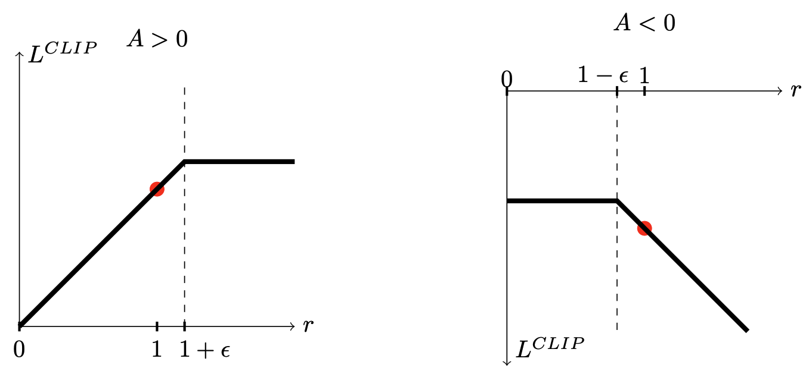
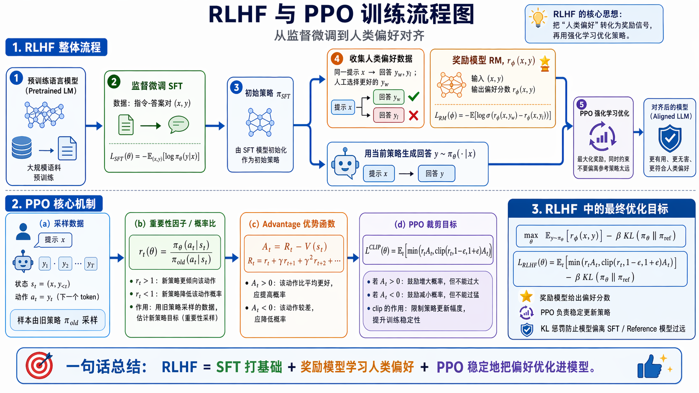

# PPO（Proximal Policy Optimization）详解

PPO（近端策略优化）可以看作 TRPO 的工程化版本：它继承了 **Actor-Critic + GAE + 旧策略重要性采样** 的主线，也继承了 TRPO「新策略不要离旧策略太远」的信任域思想，但不再显式求解带 KL 约束的二阶优化问题，而是用一个简单的一阶目标（尤其是 **clipped surrogate objective**）限制策略更新幅度。

与 TRPO 相比，PPO 的核心取舍是：放弃严格的单调改进保证，换来更简单、更稳定、更容易并行和小批量训练的实现。因此在深度强化学习和 RLHF 中，PPO 都长期是非常实用的基线算法。


## 动机：从 TRPO 到 PPO

在 TRPO 中，策略更新被写成约束优化：

$$
\max_{\theta}\; L_{\theta_{\mathrm{old}}}(\theta)
\quad \text{s.t.}\quad
\bar{D}_{\mathrm{KL}}\!\left(\pi_{\theta_{\mathrm{old}}}\,\|\,\pi_\theta\right) \le \delta,
$$

其中替代目标为：

$$
L_{\theta_{\mathrm{old}}}(\theta)
= \mathbb{E}_{s \sim \rho_{\theta_{\mathrm{old}}},\, a \sim \pi_{\theta_{\mathrm{old}}}}
\left[
\frac{\pi_\theta(a|s)}{\pi_{\theta_{\mathrm{old}}}(a|s)}
A^{\pi_{\theta_{\mathrm{old}}}}(s,a)
\right].
$$

TRPO 的思路很清晰：在旧策略附近用替代目标近似真实性能，并用平均 KL 限制策略变化。但它的实现较重：

* 需要估计 KL Hessian 或 Fisher 信息矩阵的 Hessian-vector product；
* 需要共轭梯度求近似自然梯度方向；
* 还要线搜索保证真实 KL 与替代目标满足条件。

PPO 的问题意识相同，但做法更直接：

> 不显式求解 KL 约束优化，而是在目标函数中让过大的概率比不再带来额外收益。

也就是说，PPO 把「信任域」从硬约束近似成一个易实现的目标函数形状。


## 重要性采样与概率比

PPO 每轮先用当前策略 $\pi_{\theta_{\mathrm{old}}}$ 采样一批轨迹，然后在这批数据上对新参数 $\theta$ 做若干轮 minibatch 更新。由于数据来自旧策略，而优化对象是新策略，因此需要重要性采样修正。

定义时间步 $t$ 的概率比：

$$
r_t(\theta)
= \frac{\pi_\theta(a_t|s_t)}
{\pi_{\theta_{\mathrm{old}}}(a_t|s_t)}.
$$

它有两层含义：

* 作为 **重要性权重**，用旧策略采样的数据估计新策略目标；
* 作为 **策略变化量的局部度量**，衡量新策略相对旧策略是否更偏好已采样动作 $a_t$。

若 $r_t(\theta)>1$，说明新策略比旧策略更倾向于选择该动作；若 $r_t(\theta)<1$，说明新策略降低了该动作概率。

从重要性采样公式看，对任意函数 $f(a)$：

$$
\begin{aligned}
\mathbb{E}_{a \sim p(a)}[f(a)]
&= \sum_a p(a) f(a) \\
&= \sum_a q(a)\frac{p(a)}{q(a)}f(a) \\
&= \mathbb{E}_{a \sim q(a)}
\left[
\frac{p(a)}{q(a)}f(a)
\right].
\end{aligned}
$$

对应到 PPO，就是令 $p(a)=\pi_\theta(a|s)$，$q(a)=\pi_{\theta_{\mathrm{old}}}(a|s)$，从而得到 $r_t(\theta)$。


## 未裁剪的替代目标

沿用 TRPO 的替代目标，PPO 的基础策略目标可写为：

$$
L^{\mathrm{PG}}(\theta)
= \mathbb{E}_t\left[
r_t(\theta)\,\hat{A}_t
\right],
$$

其中 $\hat{A}_t$ 是在旧策略数据上估计出的优势函数，常由 Critic 与 GAE 给出：

$$
\hat{A}_t^{\mathrm{GAE}(\gamma,\lambda)}
= \sum_{l=0}^{\infty}(\gamma\lambda)^l\delta_{t+l},
\qquad
\delta_t = r_{t+1} + \gamma V_\phi(s_{t+1}) - V_\phi(s_t).
$$

这个目标与策略梯度形式一致。因为

$$
\nabla_\theta r_t(\theta)
= r_t(\theta)\nabla_\theta \log \pi_\theta(a_t|s_t),
$$

所以在 $\theta=\theta_{\mathrm{old}}$ 处有 $r_t(\theta)=1$，进而：

$$
\nabla_\theta L^{\mathrm{PG}}(\theta)\big|_{\theta=\theta_{\mathrm{old}}}
=
\mathbb{E}_t
\left[
\hat{A}_t\nabla_\theta \log \pi_\theta(a_t|s_t)
\right]_{\theta=\theta_{\mathrm{old}}},
$$

这正是 Actor-Critic 中的策略梯度估计。

问题在于，若直接最大化 $L^{\mathrm{PG}}$，则：

* 当 $\hat{A}_t>0$ 时，目标会鼓励无限增大 $r_t(\theta)$；
* 当 $\hat{A}_t<0$ 时，目标会鼓励无限减小 $r_t(\theta)$。

这会导致新旧策略差异过大，使旧数据上的优势估计迅速失效，训练变得不稳定。


## Clipped Surrogate Objective

PPO 最常见的版本是 PPO-Clip，目标为：

$$
L^{\mathrm{CLIP}}(\theta)
=
\mathbb{E}_t
\left[
\min
\left(
r_t(\theta)\hat{A}_t,\;
\operatorname{clip}(r_t(\theta),1-\epsilon,1+\epsilon)\hat{A}_t
\right)
\right],
$$

其中 $\epsilon$ 通常取 $0.1$ 或 $0.2$。裁剪函数为：

$$
\operatorname{clip}(r_t,1-\epsilon,1+\epsilon)
=
\begin{cases}
1-\epsilon, & r_t < 1-\epsilon, \\
r_t, & 1-\epsilon \le r_t \le 1+\epsilon, \\
1+\epsilon, & r_t > 1+\epsilon.
\end{cases}
$$

这个目标的关键是外层的 $\min$。它不是简单地把 $r_t$ 裁剪后再优化，而是在「原始目标」与「裁剪目标」之间取较小者，从而构造一个保守的下界式目标：当策略更新朝着过于激进的方向走时，目标不再继续奖励这种变化。

分情况看更清楚：



（1）当 $\hat{A}_t > 0$

动作 $a_t$ 比平均水平好，应该提高其概率。未裁剪目标 $r_t\hat{A}_t$ 随 $r_t$ 增大而增大。

但当 $r_t > 1+\epsilon$ 时：

$$
\operatorname{clip}(r_t,1-\epsilon,1+\epsilon)\hat{A}_t
= (1+\epsilon)\hat{A}_t.
$$

于是：

$$
\min(r_t\hat{A}_t,(1+\epsilon)\hat{A}_t)
= (1+\epsilon)\hat{A}_t.
$$

继续增大该动作概率不会带来更大的目标值。也就是说，好动作可以被增强，但增强幅度受到限制。

（2） 当 $\hat{A}_t < 0$

动作 $a_t$ 比平均水平差，应该降低其概率。由于 $\hat{A}_t<0$，未裁剪目标 $r_t\hat{A}_t$ 会随着 $r_t$ 减小而增大。例如 $\hat{A}_t=-2$ 时，$r_t=0.5$ 给出 $-1$，比 $r_t=1$ 的 $-2$ 更大。

但当 $r_t < 1-\epsilon$ 时：

$$
\operatorname{clip}(r_t,1-\epsilon,1+\epsilon)\hat{A}_t
= (1-\epsilon)\hat{A}_t.
$$

因为 $\hat{A}_t<0$，有：

$$
(1-\epsilon)\hat{A}_t < r_t\hat{A}_t.
$$

外层 $\min$ 会选择更小的 $(1-\epsilon)\hat{A}_t$，从而阻止目标继续奖励过度降低该动作概率的行为。

因此 PPO-Clip 的直觉可以概括为：

$$
\hat{A}_t>0:\quad r_t \text{ 不应远大于 } 1+\epsilon,
$$

$$
\hat{A}_t<0:\quad r_t \text{ 不应远小于 } 1-\epsilon.
$$


## PPO 与 TRPO 的关系

TRPO 用平均 KL 约束写成：

$$
\bar{D}_{\mathrm{KL}}(\pi_{\theta_{\mathrm{old}}}\,\|\,\pi_\theta)\le \delta.
$$

PPO-Clip 并没有显式保证 KL 不超过某个阈值，而是通过限制已采样动作上的概率比 $r_t(\theta)$ 来间接限制策略变化。二者都在处理同一个问题：

> 旧策略数据只能在新旧策略接近时可靠；如果新策略离旧策略太远，重要性采样方差会变大，优势估计也会过期。

差异在于：

| 维度 | TRPO | PPO-Clip |
|---|---|---|
| 信任域形式 | 显式平均 KL 约束 | 概率比裁剪形成软限制 |
| 优化方法 | 自然梯度、共轭梯度、线搜索 | 一阶梯度下降 / Adam |
| 理论保证 | 更接近单调改进分析 | 保守目标，严格保证较弱 |
| 工程复杂度 | 高 | 低 |
| 样本使用 | 一批 rollout 通常更新一次策略 | 一批 rollout 可做多轮 minibatch 更新 |

因此，PPO 可以理解为：在保留 TRPO 稳定性思想的同时，用更便宜的一阶优化替代复杂的二阶约束优化。


## PPO-Penalty：另一种近端形式

PPO 原论文中除了 PPO-Clip，还给出过 PPO-Penalty。它更接近 TRPO 的写法：不裁剪概率比，而是在目标里直接加入 KL 惩罚：

$$
L^{\mathrm{KLPEN}}(\theta)
=
\mathbb{E}_t
\left[
r_t(\theta)\hat{A}_t
- \beta\,
D_{\mathrm{KL}}
\left(
\pi_{\theta_{\mathrm{old}}}(\cdot|s_t)
\,\|\,
\pi_\theta(\cdot|s_t)
\right)
\right].
$$

其中 $\beta$ 控制新旧策略的接近程度。若实际平均 KL 大于目标值，可增大 $\beta$；若实际平均 KL 太小，可减小 $\beta$。这种自适应 KL 惩罚也体现了「近端」思想。

实践中 PPO-Clip 更常用，因为它不需要精细调节 $\beta$，实现也更直接。但在 RLHF 中，额外 KL penalty 又会重新出现，只是那里的 KL 通常不是约束 $\pi_\theta$ 和 $\pi_{\theta_{\mathrm{old}}}$，而是约束 $\pi_\theta$ 和参考模型 $\pi_{\mathrm{ref}}$。这一点后文单独说明。


## 完整目标：Actor、Critic 与熵正则

实际实现中，PPO 通常同时优化三个部分：

1. 策略损失（Actor）；
2. 价值函数损失（Critic）；
3. 熵奖励（鼓励探索）。

若采用最小化损失的实现习惯，可写为：

$$
\mathcal{L}(\theta,\phi)
=
- L^{\mathrm{CLIP}}(\theta)
+ c_1 L^{\mathrm{VF}}(\phi)
- c_2 \mathbb{E}_t[H(\pi_\theta(\cdot|s_t))],
$$

其中 $c_1,c_2$ 是权重，$H(\pi_\theta(\cdot|s_t))$ 是策略熵。

价值函数常用平方误差：

$$
L^{\mathrm{VF}}(\phi)
=
\mathbb{E}_t
\left[
\left(
V_\phi(s_t) - \hat{R}_t
\right)^2
\right],
$$

其中 $\hat{R}_t$ 可取 GAE 对应的 bootstrap return：

$$
\hat{R}_t = \hat{A}_t + V_{\phi_{\mathrm{old}}}(s_t).
$$

这样 Actor 用 $\hat{A}_t$ 判断动作相对好坏，Critic 用 $\hat{R}_t$ 回归状态价值，熵项则防止策略过早塌缩到低熵分布。

实现中还常做 advantage normalization：

$$
\hat{A}_t \leftarrow
\frac{\hat{A}_t - \mathrm{mean}(\hat{A})}
{\mathrm{std}(\hat{A}) + 10^{-8}},
$$

这不是 PPO 理论必须项，但能显著改善数值尺度，使 minibatch 更新更平稳。


## PPO 算法流程

```
初始化策略参数 θ，价值函数参数 φ
for 每次迭代 do
  1. 保存旧策略参数 θ_old ← θ
  2. 用 π_{θ_old} 与环境交互，采样一批 rollout
  3. 用 V_φ 计算 δ_t 与 GAE，得到 Â_t
  4. 构造价值目标 R̂_t = Â_t + V_{φ_old}(s_t)
  5. 对这批数据做 K 轮 minibatch 更新：
       r_t(θ) ← π_θ(a_t|s_t) / π_{θ_old}(a_t|s_t)
       L_clip ← E[min(r_t(θ)Â_t, clip(r_t(θ),1-ε,1+ε)Â_t)]
       L_vf   ← E[(V_φ(s_t)-R̂_t)^2]
       L_ent  ← E[H(π_θ(·|s_t))]
       最小化 -L_clip + c1 L_vf - c2 L_ent
  6. 丢弃旧 rollout，重新采样
end for
```

注意：PPO 虽然会在同一批 rollout 上更新多轮，但整体仍通常被视为 **on-policy** 算法。原因是旧数据只能在新旧策略接近时短暂复用，不能像 DQN/DDPG 那样长期放入 replay buffer 任意抽样。


## PyTorch 伪代码

下面是 PPO-Clip 中最核心的损失计算。真实工程还需要处理 rollout buffer、GAE、done mask、梯度裁剪、学习率调度等细节。

```python
import torch
from torch.distributions import Categorical

def ppo_loss(model, states, actions, old_log_probs, advantages, returns,
             clip_eps=0.2, vf_coef=0.5, ent_coef=0.01):
    logits, values = model(states)
    dist = Categorical(logits=logits)

    log_probs = dist.log_prob(actions)
    entropy = dist.entropy().mean()

    ratios = torch.exp(log_probs - old_log_probs)

    surr1 = ratios * advantages
    surr2 = torch.clamp(ratios, 1.0 - clip_eps, 1.0 + clip_eps) * advantages
    actor_loss = -torch.min(surr1, surr2).mean()

    critic_loss = (returns - values.squeeze(-1)).pow(2).mean()

    loss = actor_loss + vf_coef * critic_loss - ent_coef * entropy
    return loss
```

这里用 `old_log_probs` 而不是直接存旧概率，是为了数值稳定：

$$
r_t(\theta)
= \exp\left(
\log\pi_\theta(a_t|s_t)
- \log\pi_{\theta_{\mathrm{old}}}(a_t|s_t)
\right).
$$


## RLHF 中的 PPO



RLHF（Reinforcement Learning from Human Feedback）通常包含三步：

1. **SFT**：用人工指令数据训练初始策略 $\pi_{\mathrm{SFT}}$；
2. **奖励模型**：用人类偏好数据训练 $R_\psi(x,y)$；
3. **PPO 强化学习**：把语言模型视为策略，用奖励模型和 KL 约束继续优化。

SFT 阶段的目标通常是最大化人工回答的似然，即最小化：

$$
\mathcal{L}_{\mathrm{SFT}}(\theta)
=
-\mathbb{E}_{(x,y)}
\left[
\log\pi_\theta(y|x)
\right].
$$

奖励模型常用成对偏好训练。若人类标注 $y^+ \succ y^-$，表示在同一 prompt $x$ 下更偏好 $y^+$，则 Bradley-Terry 形式为：

$$
P_\psi(y^+ \succ y^-|x)
=
\sigma
\left(
R_\psi(x,y^+) - R_\psi(x,y^-)
\right),
$$

对应损失为：

$$
\mathcal{L}_{\mathrm{RM}}(\psi)
=
-\mathbb{E}_{(x,y^+,y^-)}
\left[
\log\sigma
\left(
R_\psi(x,y^+) - R_\psi(x,y^-)
\right)
\right].
$$

得到奖励模型后，PPO 阶段希望策略生成的回答获得高奖励，同时不要偏离 SFT/reference model 太远。

在语言模型 RLHF 中，环境状态、动作和奖励可以对应为：

$$
s_t = (x,y_{<t}), \qquad a_t = y_t,
$$

其中 $x$ 是 prompt，$y_{<t}$ 是已经生成的前缀，动作 $a_t$ 是下一个 token。策略就是语言模型的 token 分布：

$$
\pi_\theta(a_t|s_t)
= \pi_\theta(y_t|x,y_{<t}).
$$

因此 token 级概率比为：

$$
r_t(\theta)
=
\frac{
\pi_\theta(y_t|x,y_{<t})
}{
\pi_{\theta_{\mathrm{old}}}(y_t|x,y_{<t})
}.
$$

完整序列 $y=(y_1,\ldots,y_T)$ 的概率为：

$$
\pi_\theta(y|x)
=
\prod_{t=1}^{T}\pi_\theta(y_t|x,y_{<t}),
$$

序列级概率比为：

$$
\frac{\pi_\theta(y|x)}{\pi_{\theta_{\mathrm{old}}}(y|x)}
=
\prod_{t=1}^{T} r_t(\theta).
$$

长序列中连乘很容易爆炸或消失，因此实现里通常使用 token-level log probability，并配合 KL penalty、advantage normalization、reward whitening 等技巧稳定训练。


## RLHF：old policy 与 reference policy 的区别

RLHF-PPO 中经常同时出现三个策略：

| 符号 | 含义 | 作用 |
|---|---|---|
| $\pi_\theta$ | 当前正在更新的策略模型 | 被优化的 actor |
| $\pi_{\theta_{\mathrm{old}}}$ | 采样当前 rollout 时冻结的旧策略 | PPO 概率比的分母 |
| $\pi_{\mathrm{ref}}$ | 参考模型，通常是 SFT 模型 | KL 正则的参照对象 |

PPO clipped objective 中的概率比是：

$$
r_t(\theta)
=
\frac{
\pi_\theta(a_t|s_t)
}{
\pi_{\theta_{\mathrm{old}}}(a_t|s_t)
},
$$

而 RLHF 中用于防止模型偏离 SFT 行为的 KL 惩罚通常与参考模型有关：

$$
D_{\mathrm{KL}}
\left(
\pi_\theta(\cdot|s_t)\,\|\,\pi_{\mathrm{ref}}(\cdot|s_t)
\right).
$$

这两个分母不能混淆：

* $\pi_{\theta_{\mathrm{old}}}$：解决「用旧 rollout 更新当前策略」的问题；
* $\pi_{\mathrm{ref}}$：解决「不要为了奖励模型分数偏离 SFT 模型太远」的问题。

一种常见的 RLHF-PPO 目标可粗略写成：

$$
\max_\theta\;
\mathbb{E}_t
\left[
\min
\left(
r_t(\theta)\hat{A}_t,\;
\operatorname{clip}(r_t(\theta),1-\epsilon,1+\epsilon)\hat{A}_t
\right)
\right]
- \beta\,
\mathbb{E}_t
\left[
D_{\mathrm{KL}}
\left(
\pi_\theta(\cdot|s_t)\,\|\,\pi_{\mathrm{ref}}(\cdot|s_t)
\right)
\right].
$$

在许多语言模型实现中，也会把 KL 惩罚并入 token 级 reward，例如：

$$
r_t^{\mathrm{total}}
=
r_t^{\mathrm{RM}}
- \beta
\left(
\log\pi_\theta(y_t|x,y_{<t})
- \log\pi_{\mathrm{ref}}(y_t|x,y_{<t})
\right),
$$

其中 $r_t^{\mathrm{RM}}$ 通常主要来自奖励模型对完整回答的打分，KL 项则在 token 级提供约束。这样得到的 reward 再进入价值估计与 GAE，最终仍通过 PPO-Clip 更新策略。


## 与 REINFORCE、Actor-Critic、TRPO 的对比

| 算法 | 策略更新信号 | 稳定策略更新的手段 | 样本使用 | 实现复杂度 |
|---|---|---|---|---|
| REINFORCE | $G_t\nabla_\theta\log\pi_\theta(a_t\|s_t)$ | baseline 降方差 | 每条轨迹通常用一次 | 低 |
| Actor-Critic | $\hat{A}_t\nabla_\theta\log\pi_\theta(a_t\|s_t)$ | Critic / GAE 降方差 | on-policy | 中 |
| TRPO | $r_t(\theta)\hat{A}_t$ | 平均 KL 硬约束 + 自然梯度 | on-policy | 高 |
| PPO | clipped $r_t(\theta)\hat{A}_t$ | 概率比裁剪 / KL penalty | rollout 短暂复用 | 中 |

从学习路线看：

$$
\text{REINFORCE}
\rightarrow
\text{Actor-Critic / GAE}
\rightarrow
\text{TRPO}
\rightarrow
\text{PPO}.
$$

REINFORCE 解决了「如何直接优化随机策略」；Actor-Critic 解决了「如何用价值函数降低方差并在线更新」；TRPO 解决了「如何限制策略更新幅度」；PPO 则把 TRPO 的信任域思想压缩成了一个简单、可小批量优化的目标函数。


## 优缺点小结

* **优点**：实现简单；训练稳定；能多轮复用 rollout；适合与 GAE、熵正则、并行采样结合；在连续控制、游戏和 RLHF 中都有成熟实践。
* **缺点**：clip 并不严格保证 KL 上界；对 $\epsilon$、学习率、更新 epoch 数、batch size 仍敏感；rollout 不能长期复用，样本效率仍不如典型 off-policy 方法。

**一句话总结**：PPO 用旧策略采样数据，通过概率比 $r_t(\theta)$ 构造替代目标，并用 clipping 限制「好动作概率升得太多」或「坏动作概率降得太多」，从而以简单的一阶优化近似 TRPO 的信任域思想。


## 参考

- Schulman et al., Proximal Policy Optimization Algorithms, 2017.
- Schulman et al., Trust Region Policy Optimization, 2015.
- Schulman et al., High-Dimensional Continuous Control Using Generalized Advantage Estimation, 2015.
- https://hrl.boyuai.com/chapter/2/ppo%E7%AE%97%E6%B3%95
