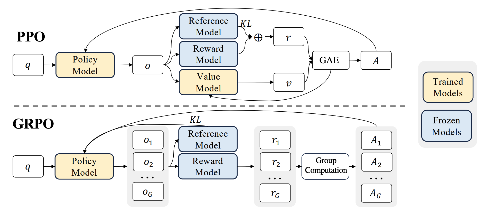

# GRPO 系列：Group Relative Policy Optimization 详解



GRPO（Group Relative Policy Optimization，组相对策略优化）是 DeepSeekMath 中提出、并在 DeepSeek-R1 系列中被广泛使用的一类 LLM 强化学习算法。它可以看作 PPO 在大语言模型推理训练场景下的轻量化改造：保留 PPO 的 **重要性采样比率 + clipping + KL 约束**，但去掉 Critic / value model，用同一个 prompt 下多条回答的组内相对奖励来估计优势。

在前面的学习路线中：

$$
\text{REINFORCE}
\rightarrow
\text{Actor-Critic}
\rightarrow
\text{TRPO}
\rightarrow
\text{PPO}
\rightarrow
\text{DPO},
$$

PPO 代表「在线 RL + value model + clipped policy update」，DPO 代表「离线偏好对 + 直接监督式优化」。GRPO 则处在 PPO 这条线上，但专门面向 LLM 的 RLVR / reasoning training 场景：

$$
\text{PPO-RLHF}
\quad \Longrightarrow \quad
\text{GRPO：无 Critic 的组内相对 PPO}.
$$

它的核心直觉非常简单：

> 对同一个问题 $q$，让当前模型生成多条回答；如果某条回答的奖励高于同组平均水平，就提高它的概率；如果低于同组平均水平，就降低它的概率。


## 动机：PPO 在 LLM 推理训练中的痛点

在 PPO-RLHF 中，通常需要同时维护三类模型：

* **Policy model** $\pi_\theta$：正在训练的语言模型；
* **Reference model** $\pi_{\mathrm{ref}}$：通常是 SFT 模型或某个冻结/周期更新的参考模型，用于 KL 约束；
* **Value model / Critic** $V_\phi$：估计状态价值，用于计算 advantage。

PPO 的优势估计常依赖 Critic 和 GAE：

$$
\hat{A}_t^{\mathrm{GAE}(\gamma,\lambda)}
=
\sum_{l=0}^{\infty}(\gamma\lambda)^l\delta_{t+l},
\qquad
\delta_t = r_{t+1} + \gamma V_\phi(s_{t+1}) - V_\phi(s_t).
$$

这在传统控制任务中很自然，但在 LLM 长链式推理中会遇到几个问题：

1. **value model 很贵**：它通常和 policy model 规模相近，训练和推理都带来显著显存与算力开销。
2. **token 级 value 难学**：许多推理任务只有最终答案奖励，前面几百甚至几千个 token 的价值很难准确预测。
3. **长 CoT 会反复修正**：模型前面写出的中间推理可能后面被推翻或修正，局部前缀的价值不稳定。
4. **GAE 超参数敏感**：$\lambda$、reward shaping、KL reward 等都会影响训练稳定性。

GRPO 的解决思路是：既然同一个 prompt 下可以采样多条回答并打分，那就直接用这组回答的相对好坏做 baseline，不再训练 Critic。


## 从 PPO 到 GRPO

回顾 PPO-Clip 在语言模型中的 token 级形式。对 prompt $q$ 采样回答 $o=(o_1,\ldots,o_{|o|})$，定义：

$$
r_t(\theta)
=
\frac{
\pi_\theta(o_t|q,o_{<t})
}{
\pi_{\theta_{\mathrm{old}}}(o_t|q,o_{<t})
}.
$$

PPO 的策略目标为：

$$
L^{\mathrm{CLIP}}(\theta)
=
\mathbb{E}_t
\left[
\min
\left(
r_t(\theta)\hat{A}_t,\;
\operatorname{clip}(r_t(\theta),1-\epsilon,1+\epsilon)\hat{A}_t
\right)
\right].
$$

区别在于 $\hat{A}_t$ 怎么来。

在 PPO 中：

$$
\hat{A}_t
\approx
\text{GAE}(r,V_\phi),
$$

需要 value model $V_\phi$。

在 GRPO 中，对同一个问题 $q$ 一次采样 $G$ 条回答：

$$
\{o_1,o_2,\ldots,o_G\}
\sim
\pi_{\theta_{\mathrm{old}}}(\cdot|q),
$$

并得到对应奖励：

$$
\mathbf{r}
=
\{r_1,r_2,\ldots,r_G\}.
$$

用组内均值作为 baseline，并用标准差归一化：

$$
\hat{A}_i
=
\frac{
r_i-\mathrm{mean}(\mathbf{r})
}{
\mathrm{std}(\mathbf{r})+\epsilon_{\mathrm{std}}
}.
$$

若采用 outcome supervision，即每条回答只有一个最终奖励，则这条回答中所有 answer token 共享同一个优势：

$$
\hat{A}_{i,t}=\hat{A}_i,
\qquad
t=1,\ldots,|o_i|.
$$

这就是「Group Relative」的含义：优势不是来自全局 value function，而是来自同一个 prompt 下多个候选回答的相对位置。


## 组内相对优势的直觉

假设对同一道数学题采样 $G=4$ 条回答，奖励为：

$$
\mathbf{r}=\{1,0,1,0\},
$$

其中 $1$ 表示最终答案正确，$0$ 表示错误。则：

$$
\mathrm{mean}(\mathbf{r})=0.5,
\qquad
\mathrm{std}(\mathbf{r})=0.5.
$$

对应优势为：

$$
\hat{A}=\{1,-1,1,-1\}.
$$

于是 GRPO 会增强两条正确回答的 token 概率，降低两条错误回答的 token 概率。相比只对正确回答做 SFT 或 rejection sampling，GRPO 同时利用了正负方向的梯度。

如果同组回答全对：

$$
\mathbf{r}=\{1,1,1,1\},
$$

则所有回答都没有组内差异，$\mathrm{std}(\mathbf{r})=0$。这类 batch 对「区分哪条更好」没有帮助，实际实现中常会加 $\epsilon_{\mathrm{std}}$，或通过动态采样跳过这类全同奖励组。这个问题也是后续 DAPO 等变体重点处理的方向之一。

组内相对优势有两个重要效果：

* **降方差**：减去组内均值相当于 prompt-specific baseline，同一道题的难度被抵消。
* **自适应难度**：难题和易题不直接比较，只比较同一 prompt 下的候选回答，因此奖励尺度更稳定。


## GRPO 目标函数

DeepSeekMath 中常见的 token-level GRPO objective 可写为：

$$
\begin{aligned}
J_{\mathrm{GRPO}}(\theta)
=
\mathbb{E}_{q \sim P(Q),\, \{o_i\}_{i=1}^{G}\sim \pi_{\theta_{\mathrm{old}}}(\cdot|q)}
\left[
\frac{1}{G}\sum_{i=1}^{G}
\frac{1}{|o_i|}
\sum_{t=1}^{|o_i|}
\left\{
\min
\left(
\rho_{i,t}(\theta)\hat{A}_{i,t},\;
\operatorname{clip}(\rho_{i,t}(\theta),1-\epsilon,1+\epsilon)\hat{A}_{i,t}
\right)
-
\beta D_{i,t}^{\mathrm{KL}}
\right\}
\right],
\end{aligned}
$$

其中 token 级重要性采样比率为：

$$
\rho_{i,t}(\theta)
=
\frac{
\pi_\theta(o_{i,t}|q,o_{i,<t})
}{
\pi_{\theta_{\mathrm{old}}}(o_{i,t}|q,o_{i,<t})
}.
$$

KL 项用于限制当前策略不要偏离 reference model 太远。DeepSeekMath 使用的一个非负 KL 估计器为：

$$
D_{i,t}^{\mathrm{KL}}
=
\frac{
\pi_{\mathrm{ref}}(o_{i,t}|q,o_{i,<t})
}{
\pi_\theta(o_{i,t}|q,o_{i,<t})
}
-
\log
\frac{
\pi_{\mathrm{ref}}(o_{i,t}|q,o_{i,<t})
}{
\pi_\theta(o_{i,t}|q,o_{i,<t})
}
-1.
$$

令：

$$
u_{i,t}
=
\frac{
\pi_{\mathrm{ref}}(o_{i,t}|q,o_{i,<t})
}{
\pi_\theta(o_{i,t}|q,o_{i,<t})
},
$$

则：

$$
D_{i,t}^{\mathrm{KL}}=u_{i,t}-\log u_{i,t}-1.
$$

因为对任意 $u>0$，都有 $u-\log u-1\ge 0$，且当 $u=1$ 时取等号，所以这个 KL estimator 始终非负。直观上，当前策略越偏离 reference，在采样 token 上的惩罚越大。


## Clipping 的作用

GRPO 沿用了 PPO-Clip 的保守更新思想。对某个 token 来说：

$$
\min
\left(
\rho_{i,t}\hat{A}_{i,t},\;
\operatorname{clip}(\rho_{i,t},1-\epsilon,1+\epsilon)\hat{A}_{i,t}
\right)
$$

分两种情况：

* 若 $\hat{A}_{i,t}>0$，说明该回答高于组内平均水平，应提高这条回答 token 的概率。但当 $\rho_{i,t}>1+\epsilon$ 后，继续提高概率不再带来额外收益。
* 若 $\hat{A}_{i,t}<0$，说明该回答低于组内平均水平，应降低这条回答 token 的概率。但当 $\rho_{i,t}<1-\epsilon$ 后，继续降低概率不再带来额外收益。

因此 GRPO 的更新方向可以概括为：

$$
\hat{A}_{i,t}>0:
\quad
\pi_\theta(o_{i,t}|q,o_{i,<t}) \uparrow,
$$

$$
\hat{A}_{i,t}<0:
\quad
\pi_\theta(o_{i,t}|q,o_{i,<t}) \downarrow,
$$

但概率变化幅度受 clipping 和 KL 共同限制。


## 与 REINFORCE baseline 的关系

GRPO 去掉 Critic，但并不是去掉 baseline。它使用的是一种 **组内经验 baseline**。

在 REINFORCE with baseline 中，策略梯度可写为：

$$
\nabla_\theta J(\theta)
\approx
\mathbb{E}
\left[
(G_t-b(s_t))
\nabla_\theta\log\pi_\theta(a_t|s_t)
\right].
$$

PPO / Actor-Critic 通常令：

$$
b(s_t)\approx V_\phi(s_t).
$$

GRPO 对同一个 prompt $q$ 的一组回答使用：

$$
b(q)
=
\mathrm{mean}(\{r_1,\ldots,r_G\}).
$$

于是：

$$
\hat{A}_i
\propto
r_i-b(q).
$$

这可以理解为：不再学习一个全局价值函数 $V_\phi(q,o_{<t})$，而是用同题多采样得到一个即时的、prompt-specific 的 baseline。它牺牲了 value model 的泛化能力，但换来了极大的工程简化。


## Outcome Supervision 与 Process Supervision

GRPO 可以配合不同粒度的 reward。

### （1）Outcome Supervision

Outcome supervision 只在完整回答结束后给一个奖励，例如：

$$
r_i=
\mathbf{1}[\text{final answer correct}].
$$

组内归一化后：

$$
\hat{A}_i
=
\frac{r_i-\mathrm{mean}(\mathbf{r})}
{\mathrm{std}(\mathbf{r})+\epsilon_{\mathrm{std}}},
$$

并令所有 token 共享：

$$
\hat{A}_{i,t}=\hat{A}_i.
$$

这种方式实现简单，特别适合数学、代码、形式化证明等可验证任务（RLVR, Reinforcement Learning from Verifiable Rewards）。

### （2）Process Supervision

Process supervision 会对推理步骤给奖励。例如把回答分成若干 reasoning steps：

$$
o_i=(\text{step}_{i,1},\ldots,\text{step}_{i,K_i}),
$$

每个 step 有对应奖励：

$$
r_{i,1},r_{i,2},\ldots,r_{i,K_i}.
$$

此时可以在 step 级或 token 级分配 advantage，让正确的中间步骤更早得到强化。优点是 credit assignment 更细，缺点是需要过程奖励模型或更复杂的规则标注。


## DeepSeek-R1 中的 GRPO 写法

DeepSeek-R1 报告中给出了一个更简洁的 sequence-level 写法。对每个问题 $q$，采样 $G$ 条回答 $o_i$，计算组内优势：

$$
A_i
=
\frac{
r_i-\mathrm{mean}(\{r_1,\ldots,r_G\})
}{
\mathrm{std}(\{r_1,\ldots,r_G\})
}.
$$

目标形式可概括为：

$$
J_{\mathrm{GRPO}}(\theta)
=
\mathbb{E}
\left[
\frac{1}{G}
\sum_{i=1}^{G}
\left(
\min
\left(
\rho_i(\theta)A_i,\;
\operatorname{clip}(\rho_i(\theta),1-\epsilon,1+\epsilon)A_i
\right)
-
\beta D_i^{\mathrm{KL}}
\right)
\right],
$$

其中 $\rho_i(\theta)$ 可以理解为序列级概率比：

$$
\rho_i(\theta)
=
\frac{\pi_\theta(o_i|q)}
{\pi_{\theta_{\mathrm{old}}}(o_i|q)}.
$$

不过实际工程中经常仍以 token log probability 实现，避免直接连乘序列概率造成数值不稳定：

$$
\log\rho_i(\theta)
=
\sum_{t=1}^{|o_i|}
\left[
\log\pi_\theta(o_{i,t}|q,o_{i,<t})
-
\log\pi_{\theta_{\mathrm{old}}}(o_{i,t}|q,o_{i,<t})
\right].
$$

需要注意：不同框架和论文中，GRPO 有 token-level 与 sequence-level 两种近似写法。理解时抓住主线即可：

> 多条回答组成 group，用组内相对 reward 估计 advantage，再用 PPO-style clipping 和 KL 控制策略更新。


## GRPO 算法流程

```
初始化策略模型 π_θ，参考模型 π_ref
for 每个训练 step do
  1. 从任务数据中采样一批 prompt q
  2. 对每个 q，用旧策略 π_{θ_old} 生成 G 条回答 {o_i}_{i=1}^G
  3. 用规则、奖励模型或代码执行器计算每条回答奖励 r_i
  4. 对同一个 q 内的奖励做归一化：
       A_i = (r_i - mean({r_1,...,r_G})) / (std({r_1,...,r_G}) + eps)
  5. 将 A_i 分配给回答 o_i 的 token，得到 A_{i,t}
  6. 计算 token 级概率比：
       ρ_{i,t}(θ) = π_θ(o_{i,t}|q,o_{i,<t}) / π_{θ_old}(o_{i,t}|q,o_{i,<t})
  7. 最大化：
       min(ρA, clip(ρ,1-ε,1+ε)A) - β KL(π_θ || π_ref)
  8. 更新 θ；按设置决定是否周期性更新 π_ref 或 θ_old
end for
```

其中 $\pi_{\theta_{\mathrm{old}}}$ 是采样当前 rollout 的旧策略，$\pi_{\mathrm{ref}}$ 是 KL 参考策略。二者角色不同，和 PPO-RLHF 中的 old policy / reference policy 区分一致。


## PyTorch 伪代码

下面只展示 GRPO loss 的核心计算。假设已经得到：

* `rewards`: shape 为 `[batch, G]`；
* `logps`: 当前策略在 answer tokens 上的 log probability，shape 为 `[batch, G, T]`；
* `old_logps`: 旧策略 log probability；
* `ref_logps`: reference model log probability；
* `mask`: answer token mask。

```python
import torch

def grpo_loss(logps, old_logps, ref_logps, rewards, mask,
              clip_eps=0.2, beta=0.01, std_eps=1e-6):
    # group-relative advantage: [B, G]
    mean = rewards.mean(dim=1, keepdim=True)
    std = rewards.std(dim=1, keepdim=True, unbiased=False)
    advantages = (rewards - mean) / (std + std_eps)

    # broadcast to token level: [B, G, T]
    advantages = advantages.unsqueeze(-1)

    ratios = torch.exp(logps - old_logps)
    surr1 = ratios * advantages
    surr2 = torch.clamp(ratios, 1.0 - clip_eps, 1.0 + clip_eps) * advantages
    policy_term = torch.min(surr1, surr2)

    # non-negative KL estimator: u - log u - 1, u = π_ref / π_θ
    log_u = ref_logps - logps
    u = torch.exp(log_u)
    kl = u - log_u - 1.0

    per_token_objective = policy_term - beta * kl
    loss = -(per_token_objective * mask).sum() / mask.sum().clamp_min(1)
    return loss
```

真实训练还需要处理 generation、reward function、动态 padding、分布式 rollout、micro-batch、KL 监控、梯度裁剪等工程细节。上面的代码只是公式骨架。


## GRPO 与 PPO、DPO 的对比

| 维度 | PPO-RLHF | GRPO | DPO |
|---|---|---|---|
| 训练方式 | 在线 RL | 在线 RL / RLVR | 离线偏好优化 |
| 是否需要 Critic | 需要 value model | 不需要 | 不需要 |
| Advantage 来源 | GAE + $V_\phi$ | 同 prompt 组内相对奖励 | 无 advantage |
| 数据形式 | prompt + 采样回答 + reward | prompt + 多条采样回答 + reward | 偏好对 $(x,y_w,y_l)$ |
| KL 约束 | 常作为 token reward 或 loss 项 | 常直接加入 loss | 隐式来自 reference log ratio |
| 工程复杂度 | 高 | 中 | 低 |
| 适用场景 | 通用 RLHF | 数学/代码/可验证推理 | 偏好对齐、离线训练 |

GRPO 和 PPO 的关系最紧密：它仍然是 policy gradient 方法，只是把 Critic baseline 替换成 group baseline。DPO 则更像把 KL-regularized RLHF 解析成监督式 pairwise loss，不需要在线采样。


## GRPO 系列变体

GRPO 被大量用于 reasoning model 训练后，出现了一系列围绕它的改进。这里先做概念性梳理，方便之后继续扩展。参考 https://hugging-face.cn/blog/NormalUhr/grpo-to-dapo-and-gspo

### （1）R1-style GRPO

DeepSeek-R1-Zero 直接从 base model 开始做大规模 RL，没有先做 SFT。奖励主要来自可验证任务的最终答案正确性与格式约束。这说明在数学、代码等可验证任务上，纯 RL 也可能诱导出长链式推理、自我检查和反思行为。

DeepSeek-R1 则加入 cold-start 数据、多阶段 SFT 与 RL，以改善 R1-Zero 的可读性、语言混杂等问题。

### （2）DAPO

DAPO（Decoupled Clip and Dynamic sAmpling Policy Optimization）可以看作 GRPO 的工程增强版，常见改动包括：

* **Clip-Higher**：对上裁剪边界和下裁剪边界解耦，给正优势样本更大的提升空间；
* **Dynamic Sampling**：动态采样直到组内既有正样本也有负样本，避免全对/全错 group 没有有效梯度；
* **Token-level policy gradient loss**：更细粒度地处理 token 级目标；GRPO中是先对每个回答按长度求平均，再对group求平均，这样长回答中每个token的贡献较低。改进方法是按group中token总数求平均。
* **Overlong reward shaping**：对过长输出做过滤或软惩罚。

这些改动主要针对长 CoT 训练中的无效样本、熵下降和过长回答问题。

### （3）GSPO

GSPO（Group Sequence Policy Optimization）认为：如果奖励是 sequence-level 的，那么重要性采样和 clipping 也应更偏 sequence-level。它将 token 级概率比：

$$
\rho_{i,t}
=
\frac{\pi_\theta(o_{i,t}|q,o_{i,<t})}
{\pi_{\theta_{\mathrm{old}}}(o_{i,t}|q,o_{i,<t})}
$$

替换为长度归一化的序列级比率：

$$
\rho_i^{\mathrm{seq}}
=
\exp
\left(
\frac{1}{|o_i|}
\sum_{t=1}^{|o_i|}
\left[
\log\pi_\theta(o_{i,t}|q,o_{i,<t})
-
\log\pi_{\theta_{\mathrm{old}}}(o_{i,t}|q,o_{i,<t})
\right]
\right).
$$

这样做的目标是让「优化单位」更贴近「奖励单位」，降低 token-level ratio 在长序列和 MoE 训练中带来的高方差。


## 常见细节与注意点

### （1）组大小 $G$

$G$ 越大，组内均值和标准差越稳定，但 rollout 成本越高。数学推理训练中常用多个 completions per prompt 来制造相对比较信号。若 $G=1$，就无法计算组内相对优势。

### （2）奖励标准差为零

如果同一 prompt 的所有回答奖励完全相同，则：

$$
\mathrm{std}(\mathbf{r})=0.
$$

这时 advantage 没有区分度。实现上一般加 $\epsilon_{\mathrm{std}}$，也可能丢弃这类 group 或重新采样。

### （3）长度偏置

如果对每条回答做 $\frac{1}{|o_i|}\sum_t$ 平均，长回答和短回答的 token 贡献会被归一化；如果直接对所有 token 求平均，则长回答贡献更大。不同实现的长度处理会影响模型是否倾向生成更长 CoT。

### （4）reference model 是否更新

在普通 RLHF 中，$\pi_{\mathrm{ref}}$ 常固定为 SFT 模型。长时间 GRPO 训练时，策略可能逐渐远离初始 reference。DeepSeek-R1 报告中提到过周期性更新 reference policy，以平衡探索范围和训练稳定性。是否更新 reference 是一个重要工程选择。

### （5）GRPO 不是离线偏好学习

GRPO 需要当前策略在线生成样本，再由规则或奖励模型打分。它不像 DPO 那样只依赖静态偏好对。因此 GRPO 更适合可验证任务或能稳定自动打分的任务。


## 优缺点小结

* **优点**：不需要 value model；显著降低 PPO 的显存和算力开销；天然适合同一 prompt 多采样；在数学、代码等可验证推理任务上效果强；保留 PPO clipping 和 KL 的稳定性机制。
* **缺点**：需要每个 prompt 多次采样，rollout 成本高；组内奖励全同会导致有效梯度不足；依赖 reward function 质量；token-level ratio 在长序列中可能带来高方差；长度处理和 reference 更新会显著影响训练行为。

**一句话总结**：GRPO 用「同题多回答」的组内相对奖励替代 PPO 的 value model，把优势估计从 learned critic 变成 prompt-specific 的经验 baseline，从而在保持 PPO-style 稳定更新的同时，大幅降低 LLM 强化学习训练的工程成本。


## 参考

- [DeepSeekMath: Pushing the Limits of Mathematical Reasoning in Open Language Models](https://arxiv.org/abs/2402.03300)
- [DeepSeek-R1: Incentivizing Reasoning Capability in LLMs via Reinforcement Learning](https://arxiv.org/abs/2501.12948)
- Schulman et al., Proximal Policy Optimization Algorithms, 2017.
- Schulman et al., High-Dimensional Continuous Control Using Generalized Advantage Estimation, 2015.
- [Group Sequence Policy Optimization](https://arxiv.org/abs/2507.18071)
- https://hugging-face.cn/blog/NormalUhr/grpo-to-dapo-and-gspo
